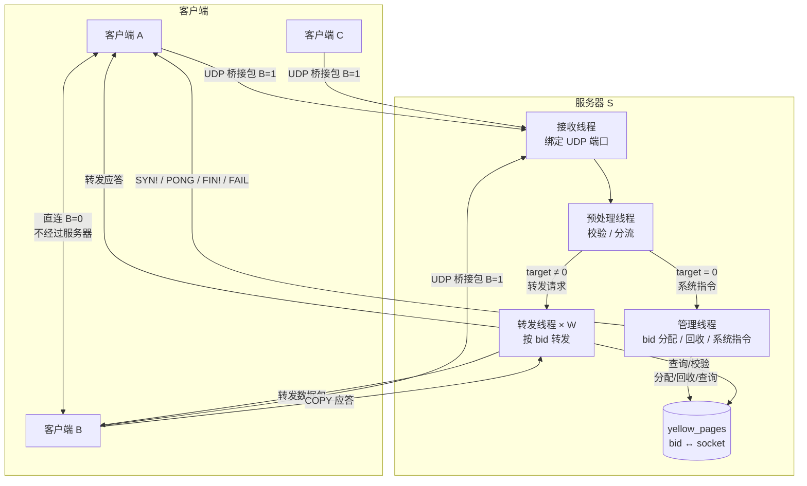
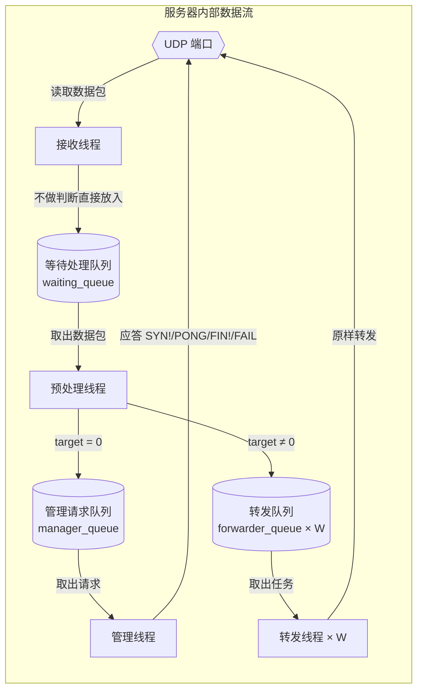
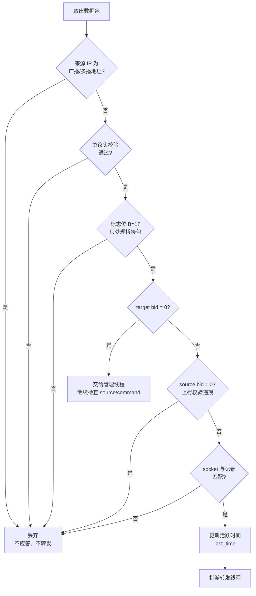
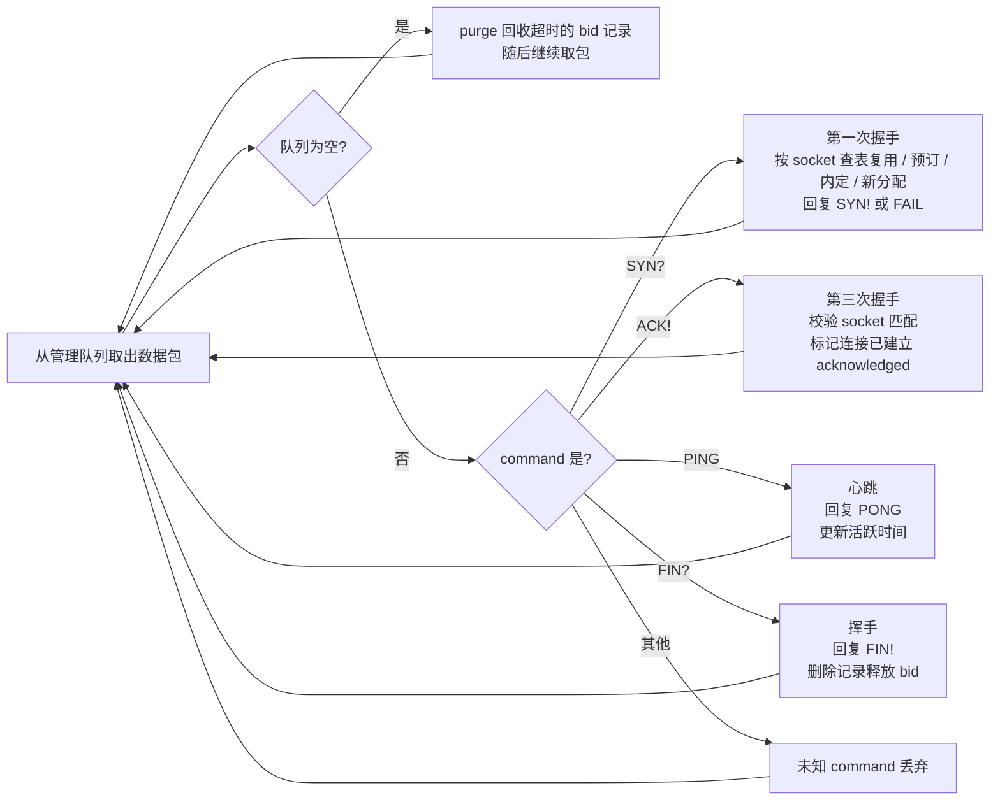
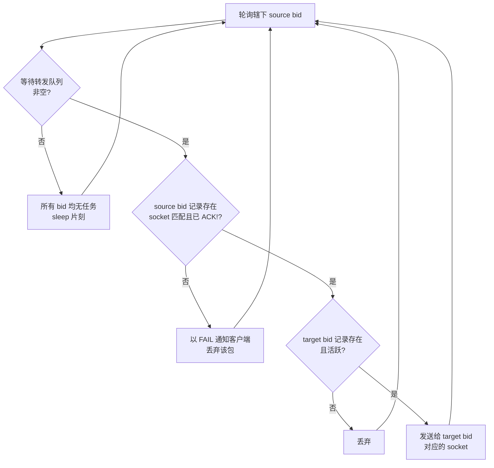

# Magpie Bridge Architecture 架构设计

Magpie 采用 **N:1 的 C-S 结构**：S 为离散型转发节点（"桥"），一个服务器可以十分高效地为众多客户端提供转发服务，但仅限于已在本服务器上注册的客户端。

服务器只为客户端提供最简单的转发服务，不与其他服务器关联；转发服务器彼此独立，客户端根据连通速度自行选择转发服务器。

## 网络结构

> 客户端与客户端之间优先直连（B=0，无 bid 字段）；无法直连时经服务器转发（B=1）。

## 服务器设计

服务器内部逻辑被设计为**收发分离**，即接收和转发各由单独的线程处理。

服务器在内存中维护一张 bid -> socket 信息映射表 **yellow_pages**。

> 形状约定：六边形 = 外部端点（UDP 端口）；矩形 = 处理单元（线程）；圆柱 = 缓冲存储（队列）。

### 0. 接收线程

服务器启动时绑定一个 UDP 端口，接收线程从该端口接收数据包之后，不做任何判断，直接将数据包与 socket 信息一起塞进预处理线程的等待列表中。

由于 UDP 只绑定一个端口，所以不会随着用户数增加而增加 fd 占用开销。

### 1. 预处理线程

从等待列表中取出数据包，处理流程如下：

**校验清单**：

- 来源 IP 为广播或多播地址（IPv4 224.0.0.0/4 与 255.255.255.255、IPv6 ff00::/8 等）直接丢弃，不应答、不转发；正常数据包的来源地址不可能是广播/多播地址，此类来源多为伪造，若不丢弃，服务器向其应答/转发会使数据扩散到整个广播域或多播组，形成放大攻击；
- Magic Code；
- Type、header length、payload length，以及相互关系；
- 将实际数据包的长度与根据上面各字段计算得到的值进行比较；
- C=1 时 command 必须非 0（全 0 判定为错误包）；除此之外不校验 command 的具体取值，一律放行（具体值是否为系统指令、如何应答，由管理线程按场景处理，客户端自定义 command 亦不受限）；
- B=1 时 target bid 与 source bid 非 0 时不能相等（服务器转发包不能发往同一个客户端；同时为 0 是第一次握手包，例外），判定后直接丢弃。

> 备注：source bid 为 0 时 target bid 也必定为 0，这种情况只会在"第一次握手包"中存在；反之（source bid = 0 且 target bid ≠ 0）则属于上行校验违规，直接丢弃（见上方流程图步骤）。

### 2. 管理线程

从管理请求队列中取出数据包，然后判断是哪种类型的请求；若无法识别为下列任一类型（未知 command），直接丢弃退出。
如果管理请求队列为空（管理线程空闲），则调用 purge(now) 回收超时的 bid 记录（详见 server 文档）。

管理线程处理流程：

> 管理线程按 socket 配对应答：从哪个 socket 收到请求，就回哪个 socket；source bid 仅用于身份校验（验证 bid 与 socket 的绑定关系），不参与应答寻址。

### 3. 转发线程（W 条）

服务器启动时自动安排 W 条转发线程处理任务（默认 W=8），预处理线程在分配转发任务时先计算 `n = (source bid) % W`，然后指派给第 n 条转发线程。

转发线程内部为每个 source bid 创建一个等待转发队列，指派任务时直接将数据包放进相应的队列中。

#### 转发线程 runloop

为了公平起见，避免单个用户发送大量数据严重干扰其他用户的正常请求，轮训任务时采用"广度优先"策略：

#### 流量控制

为了避免流量风暴，转发线程需要增加一个限流措施（设定一个在规定时间内最多处理多少任务的上限值）。
由于系统将转发任务拆分给 W=8 条线程处理，所以单条线程的任务达到上限不会影响其他线程，将风暴控制在一个很小的影响范围之内。

采用**滑动窗口**方式限流：达到窗口上限后本轮窗口内不再取新任务，等待下一个窗口再继续；超过队列容量的新包直接丢弃并记录日志（由客户端可靠传输机制重试）。具体窗口时长、每窗口处理上限与队列容量等参数及默认值见 server 文档。
