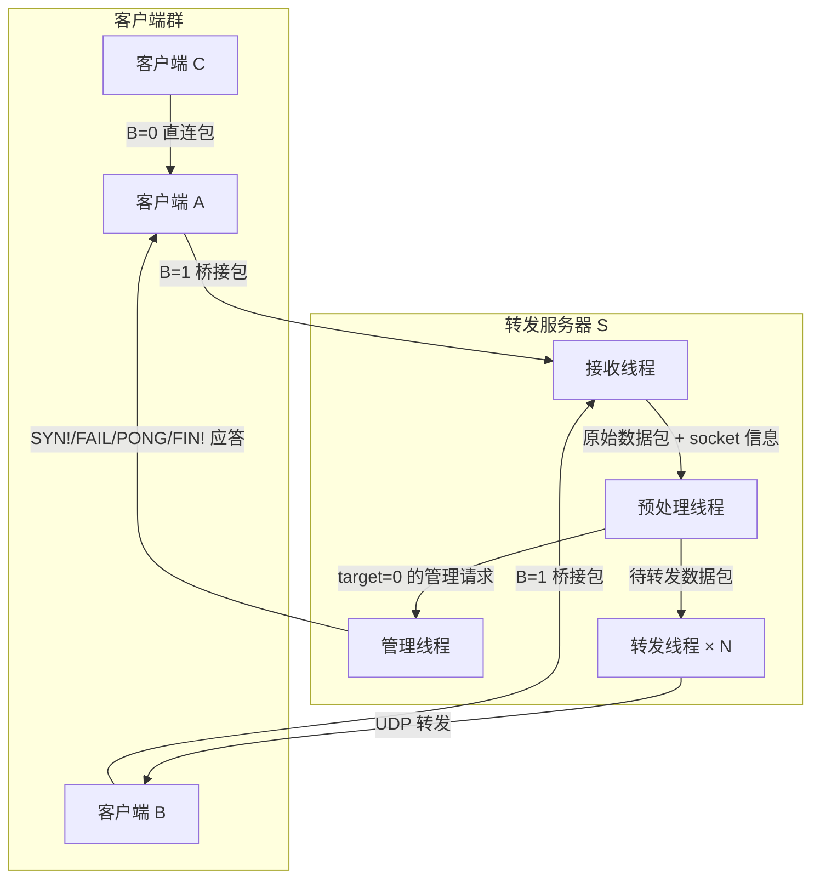
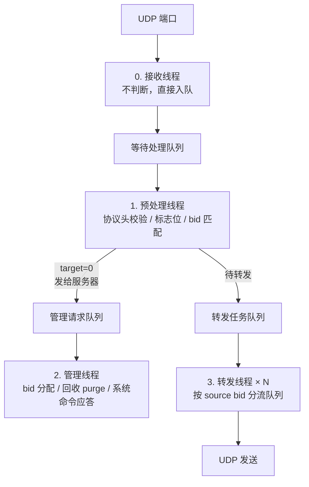

# Magpie Bridge Architecture（架构设计）

> 网络结构 N:1 的 C-S 结构。S 为离散型转发节点，只为已注册客户端提供最简单转发服务，不与其他服务器关联。

## 1. 系统架构

> 服务器只为客户端提供转发服务；客户端之间可直连时（B=0）不经过服务器。

## 2. 服务器内部架构

服务器内部逻辑收发分离，内存中维护一张 `bid -> socket 信息` 映射表 **yellow_pages**。

## 3. 模块角色概述

| 模块 | 角色 |
|------|------|
| 客户端 SDK | 封装 Message Packet 的构造/解析/分包/去重/应答（见 sdk.md） |
| 服务器 | 接收、校验、转发桥接包（B=1），维护 bid 注册（见 server.md） |
| yellow_pages | 内存分配表：`bid -> socket 信息` 一一对应映射 |

服务器内部四类线程各司其职：**接收线程**收包入队（不判断）；**预处理线程**校验并分流（管理/转发）；**管理线程**负责 bid 分配、回收 purge、系统命令应答；**转发线程 × N** 按 `source bid % N` 分流转发。

> 线程详细设计（预处理 4 项校验、管理线程命令分派、转发 runloop、流量控制）、Bridge ID 管理（生成规则、冲突判定、内存分配表、分配与回收、内定与预订机制）及工程目录，见 server.md。
