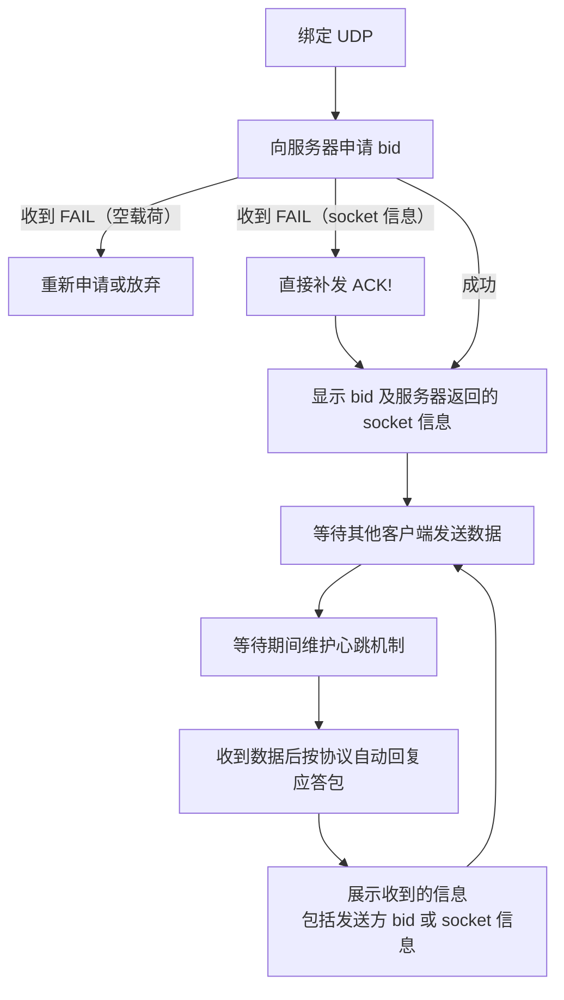
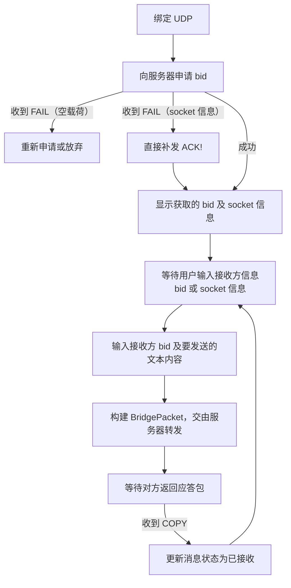

# Magpie Client（客户端示例）

> Magpie 客户端示例，演示桥接通讯测试流程。两个客户端 A 和 B。

## 0. 数据包唯一标识（mid）

客户端在接收数据包时，需要对 (sn, index) 进行去重（同一数据包可能因网络重传或应答重发而多次到达）。mid 由客户端自行计算，这里仅作建议：

```
mid = (sn << 32) | index
```

其中 sn 即协议头序列号字段的值。sn 固定占用高 32 位、index 固定占用低 32 位，两者互不重叠，与分包参数宽度 E 无关，天然无碰撞；E=0 时无 index，可令 index=0（此时 mid = sn << 32）。客户端也可采用其他任何能唯一标识一个数据包的方案，不硬性规定。

去重仅针对数据包（含应答包）进行，系统指令（D=0）不参与。

> 只要遇到 D=1 且 A=0 的数据包，不管 mid 是否重复，都必须回复 "COPY" 应答。

## 1. 发送队列

普通数据包需要等待对方确认（"COPY"），由客户端维持以下发送队列实现可靠传输：

1. 发送时 D=0 的数据包（系统命令）放入队列 **Q1**，D=1 且 A=1 的（数据应答包）放入 **Q2**，D=1 且 A=0 的（普通数据包）放入 **Q3**；
2. 这 3 个队列轮流出队发送，前两个队列的消息包发完即丢弃，第 3 个队列的消息包发完之后放入一个等待队列 **Q4**；
3. 等待队列 Q4 有上限 **M**（发送窗口，便于控制流量），如果满了就不再从 Q3 出队（Q1、Q2 依然正常轮流出队）；
4. 如果收到 D=1 且 A=1 的应答包（"COPY"），则检查 Q4 中是否存在匹配的，有则出队删除，为 Q3 腾出空间；
5. 定期轮询 Q4，找出最后一次发送时间距离现在超过 **T**（默认值 2 分钟）的数据包进行重发，并记录重发次数，超过重发次数 **K**（默认 3 次）仍然无应答的包直接丢弃。

> 去重与应答分离：收到重复的普通数据包（D=1, A=0）时，即使 mid 已在去重表中，也必须回复 "COPY"——否则若之前的 "COPY" 在网络上丢失，发送方会一直重传。

## 2. 客户端 A（被动模式）



1. 绑定 UDP，然后向服务器申请 bid（若收到 "FAIL"：载荷为空则重新申请或放弃；载荷为 socket 信息 `{"UDP":"ip:port"}` 则说明连接未确认，直接补发 "ACK!"）；
2. 将获取到的 bid 显示出来，包括服务器返回的 socket 信息；
3. 等待其他客户端发送数据；
4. 等待期间需要维护心跳机制；
5. 收到其他客户端发送的数据后按照协议自动回复应答包；
6. 将收到的信息展示出来，包括发送方信息（bid 或 socket 信息）等。

## 3. 客户端 B（主动模式）



1. 绑定 UDP，然后向服务器申请 bid（若收到 "FAIL"：载荷为空则重新申请或放弃；载荷为 socket 信息 `{"UDP":"ip:port"}` 则说明连接未确认，直接补发 "ACK!"）；
2. 将获取的 bid 显示出来，包括服务器返回的 socket 信息；
3. 等待用户输入接收方信息（bid 或 socket 信息）；
4. 等待用户输入接收方的 bid，以及要发送的文本内容；
5. 构建 BridgePacket，交由服务器转发；
6. 等待对方返回应答包，然后更新消息状态为“已接收”。

## 4. 工程目录

> 其中 Dart 版客户端为 Flutter 样板工程。

| 语言 | 工程根目录 |
|------|-----------|
| Java 版客户端 | `magpie/tests-java/` |
| Dart 版客户端 | `magpie/tests-dart/` |
