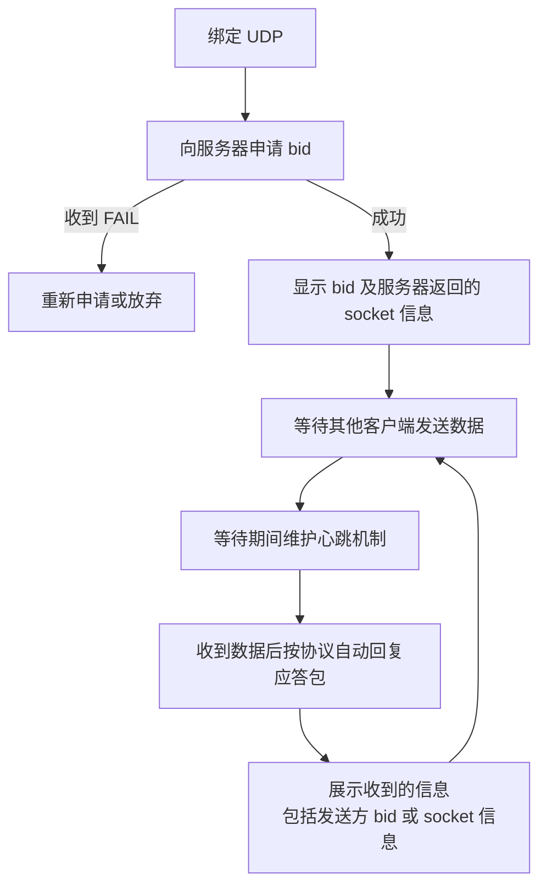
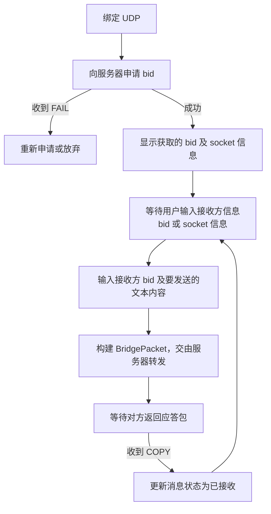

# Magpie Client（客户端示例）

> Magpie 客户端示例，演示桥接通讯测试流程。两个客户端 A 和 B。

## 1. 客户端 A（被动模式）

1. 绑定 UDP，然后向服务器申请 bid（若收到 "FAIL" 则重新申请或放弃）；
2. 将获取到的 bid 显示出来，包括服务器返回的 socket 信息；
3. 等待其他客户端发送数据；
4. 等待期间需要维护心跳机制；
5. 收到其他客户端发送的数据后按照协议自动回复应答包；
6. 将收到的信息展示出来，包括发送方信息（bid 或 socket 信息）等。

## 2. 客户端 B（主动模式）

1. 绑定 UDP，然后向服务器申请 bid（若收到 "FAIL" 则重新申请或放弃）；
2. 将获取的 bid 显示出来，包括服务器返回的 socket 信息；
3. 等待用户输入接收方信息（bid 或 socket 信息）；
4. 等待用户输入接收方的 bid，以及要发送的文本内容；
5. 构建 BridgePacket，交由服务器转发；
6. 等待对方返回应答包，然后更新消息状态为“已接收”。

## 3. 工程目录

| 语言 | 工程根目录 |
|------|-----------|
| Java 版客户端 | `magpie-bridge/tests-java/` |
| Dart 版客户端 | `magpie-bridge/tests-dart/` |
