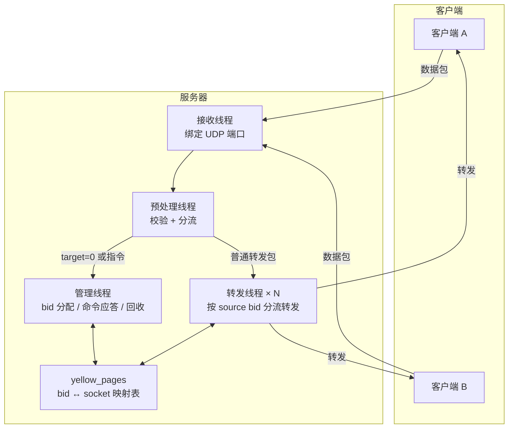
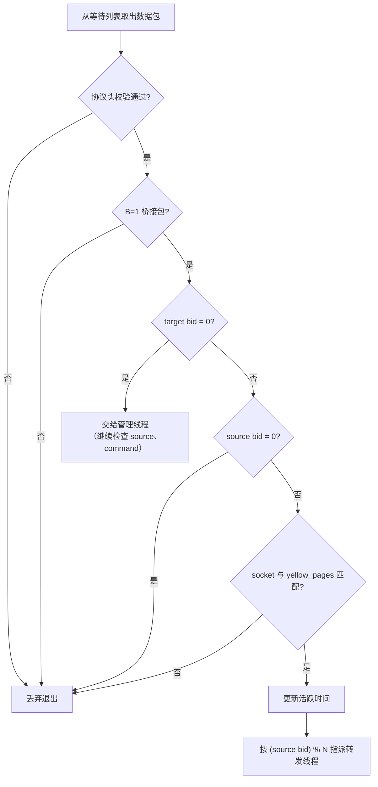
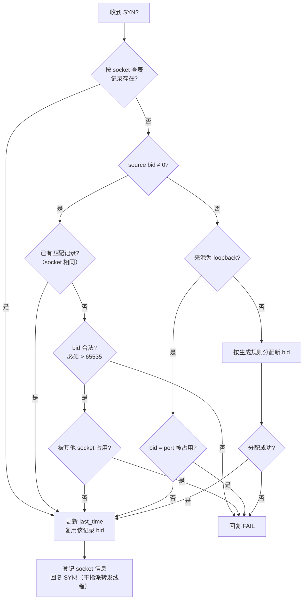
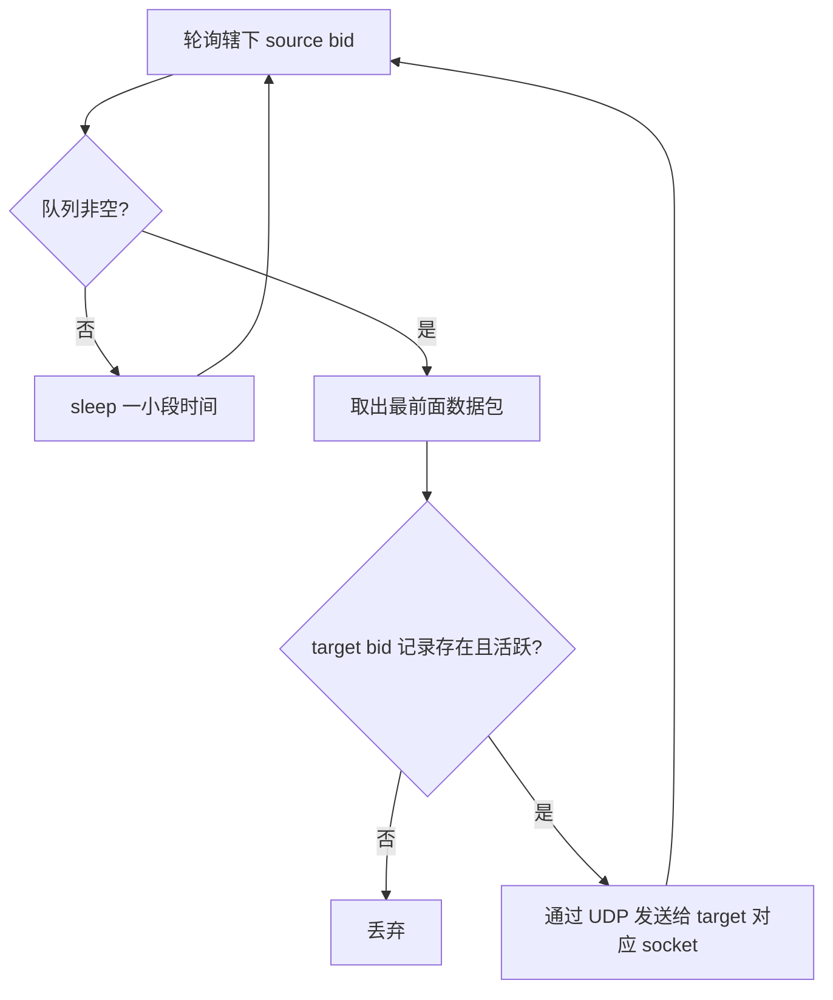
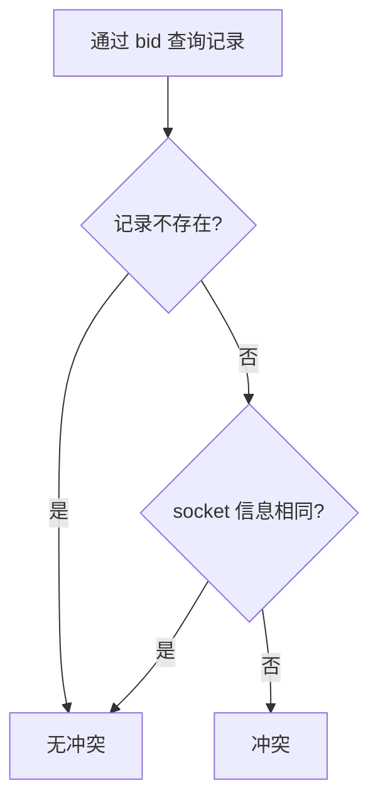
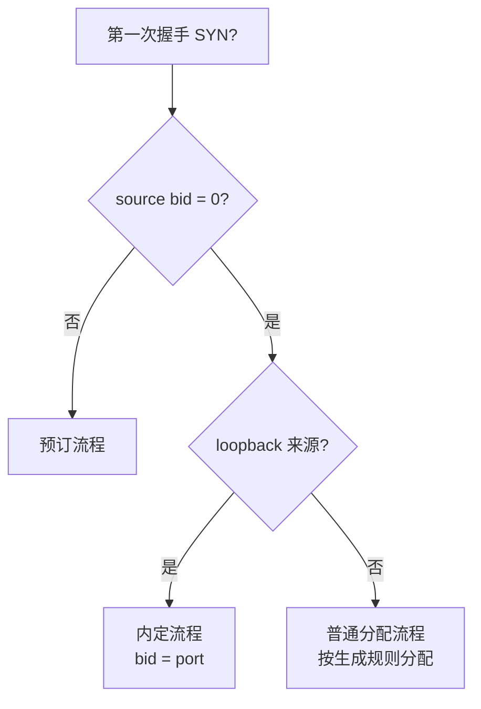

# Magpie Bridge 架构设计

网络结构为 **N:1 的 C-S 结构**：服务器是离散型转发节点，为众多客户端提供转发服务，但仅限已在本服务器注册的客户端；服务器之间互不关联。服务器在内存中维护一张 `bid -> socket` 映射表 **yellow_pages**。

## 1. 系统架构

> 服务器收发分离：接收与转发各由单独线程处理。UDP 只绑定一个端口，不会随用户数增加而增加 fd 占用。

## 2. 线程职责

### 2.1 接收线程

服务器启动时绑定一个 UDP 端口，接收数据包后不做任何判断，直接连同 socket 信息塞进预处理线程的等待列表。

### 2.2 预处理线程

> source bid 为 0 时 target bid 也必定为 0，这种情况只会在第一次握手包中存在；反之 source=0 而 target≠0 属于错误包，直接丢弃。
> 预处理线程只校验协议头与标志位，不校验 command 具体值。

### 2.3 管理线程

从管理请求队列取出数据包，按 command 判断类型；无法识别（未知 command）直接丢弃。管理请求队列为空（空闲）时调用 `purge(now)` 回收超时的 bid 记录。

#### 第一次握手（command == "SYN?"，C=1 必须，source 可为 0 或期望 bid）

#### 第三次握手（command == "ACK!"，source bid > 0 必须）

取出 source bid 与内存记录比较：socket 不匹配直接丢弃；一致则更新活跃时间，指派转发线程。

#### 心跳（command == "PING"，source bid > 0 必须）

按协议回复 PONG，同时更新活跃时间。

#### 挥手（command == "FIN?"，source bid > 0 可选）

删除记录，释放 bid。

### 2.4 转发线程（N 条，默认 N=256）

预处理线程按 `n = (source bid) % N` 指派到第 n 条转发线程；转发线程内部为每个 source bid 维护一个等待转发队列。

> 采用"广度优先"轮询，避免单个用户大量发包干扰其他用户。
> **流量控制**：设定单位时间处理任务上限，风暴被限制在单条线程的小范围内，不影响其他线程。

## 3. Bridge ID 管理

bid 为 32 位无符号整数，由高 16 位 H 与低 16 位 L 合并而成：

- H（0 ~ 65535）：**0 为内定保留区间**（loopback）；**1 ~ 32767 为当前启用的普通分配与预订区间**；**32768 ~ 65535 为预留区间**（当前不启用但合法）；
- L（0 ~ 65535）：随机值，与端口取值范围一致；
- socket 信息含 ip 和 port，作 key 查询时用 `"{ip}:{port}"` 字符串；
- 设计要求：**bid 与 socket 信息一一对应**。

### 3.1 生成规则

1. 内部变量 n 初始为 1，最大 32767；
2. 每次生成取 H = n，然后 n 自动 +1（超过最大值回到 1）；
3. 每次生成取 L = r（随机整数 0 ~ 65535）；
4. 得到 bid = (H << 16) | L；
5. 检查分配表，冲突则回到步骤 2 重试；
6. 重试达 M 次（M=16）仍冲突，表示服务器已满，由管理线程回复 FAIL。

> 自动分配时 H 仅在 1 ~ 32767 循环，即不会自动分配 H ≥ 32768 的 bid；预留区间仅可能由客户端预订产生。

### 3.2 冲突判定

> 记录回收仅由管理线程在空闲时通过 purge 完成，其他线程不做超时覆盖判断——记录存在且 socket 不同即视为冲突。

### 3.3 内存分配表

以 bid 为 key 或 socket 信息为 key 均可查询；记录字段：**bid、socket 信息、last_time**。

服务器每次收到数据包并检查通过后更新 last_time；只有预处理线程和管理线程会更新 last_time，转发线程不需要（指派前已更新）。

### 3.4 分配与回收

服务器收到 "SYN?" 时的完整流程（见 2.3 流程图）：

1. **按 socket 查表**：记录存在（socket 一定匹配）→ 更新 last_time 复用 bid；
2. **预设 source bid（预订）**：已有匹配记录（socket 相同，如 loopback 重握手携带内定 bid）→ 复用；否则检查合法性（必须 > 65535，不能预订 H=0 内定区间）→ 非法回复 FAIL；合法则检查占用 → 未被占用则创建记录返回，被占用则回复 FAIL；
3. **loopback 且 source=0（内定）**：分配 bid = port → 无记录或 socket 相同则创建/复用；被其他 socket 占用则回复 FAIL（冲突由客户端进程自行协商）；
4. **其他来源且 source=0（普通分配）**：按生成规则分配 → 无记录则创建返回；记录存在且 socket 相同则复用（小概率）；bid 相同但 socket 不同则重新生成（重试 M 次仍冲突回复 FAIL）。

> 每次新建分配记录时，同时建立 bid 与 socket 信息两个索引指向该记录。

**回收（purge）**：管理线程空闲时调用 `purge(now)`，删除所有 `last_time < now - expires` 的记录（同时删除 bid 和 socket 索引）；回收时效 **expires = 3600 × 24（24 小时）**，purge 调用间隔不小于 10 分钟。

> 在线判定窗口 T（一般小于 2 分钟）与回收时效 expires（24 小时）是两个不同参数：T 用于转发线程判断记录是否活跃（在线），expires 用于管理线程回收超时记录。

### 3.5 内定与预订机制

由于端口 port 取值范围（0 ~ 65535）与 bid 低 16 位 L 一致，特设 **H=0 作为内定区间保留给内部进程**：

- **内定**：loopback 来源（127.0.0.0/8、::1/128）且第一次握手 source=0 时，直接用 port 作为 bid（H=0）。内定 bid 与其他 bid 一样参与超时回收（24 小时无上行数据即释放）；若被其他 socket 占用（如不同 loopback IP 相同端口），回复 FAIL，由客户端进程自行协商；
- **预订**：客户端（无论 loopback 还是外部）在 "SYN?" 中预设 source bid（非 0）即走预订流程：已有匹配记录（socket 相同，如 loopback 重握手携带之前的内定 bid）直接复用；否则须合法（> 65535）且未被占用，非法或被占用回复 FAIL，由客户端决定重新申请或放弃。

> 客户端不能预订 H=0 内定区间（0 ~ 65535），所有预订成功的 bid 必定 > 65535；预订 bid 不设上限（H 合法范围 0 ~ 65535），其中 H ≥ 32768（bid ≥ 2147483648）属于预留区间，服务器校验时不拒绝，但实际应用中无特殊原因不要申请；loopback 客户端若想放弃"内定权利"，在 "SYN?" 中预设 source bid 走预订流程即可。
