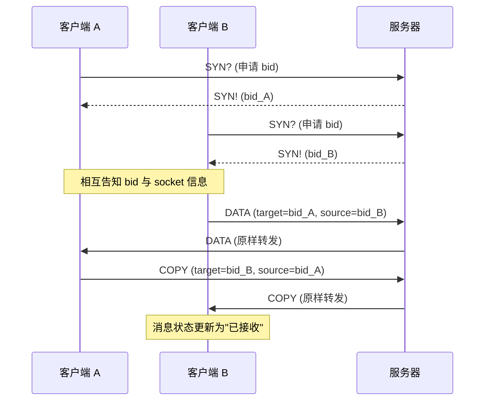

# Magpie Bridge 客户端示例

两个客户端 A 和 B 通过服务器桥接通讯的完整流程示例。

## 1. 桥接通讯流程

> 申请 bid 时若收到 FAIL（预订被占用/非法、内定冲突、服务器已满），则重新申请或放弃。

## 2. 客户端 A（被动模式）

1. 绑定 UDP，向服务器申请 bid（若收到 FAIL 则重新申请或放弃）；
2. 显示获取到的 bid，包括服务器返回的 socket 信息；
3. 等待其他客户端发送数据；
4. 等待期间维护心跳机制；
5. 收到其他客户端的数据后按协议自动回复应答包（COPY）；
6. 展示收到的信息，包括发送方信息（bid 或 socket 信息）。

## 3. 客户端 B（主动模式）

1. 绑定 UDP，向服务器申请 bid（若收到 FAIL 则重新申请或放弃）；
2. 显示获取到的 bid，包括服务器返回的 socket 信息；
3. 等待用户输入接收方信息（bid 或 socket 信息）；
4. 等待用户输入接收方 bid 及要发送的文本内容；
5. 构建 BridgePacket 交由服务器转发；
6. 等待对方返回应答包，更新消息状态为"已接收"。

## 4. 工程目录

| 语言 | 工程根目录 |
|------|-----------|
| Java | magpie-bridge/tests-java/ |
| Dart | magpie-bridge/tests-dart/ |
