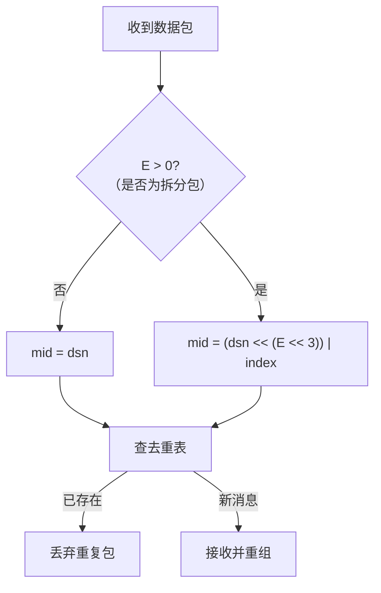

# Magpie Bridge Protocol（协议设计）

> Magpie Messaging Protocol v1 —— 基于 UDP 的可靠消息传递协议。

## 1. 协议概述

消息包由**协议头（header）**和**载荷（payload）**两部分组成：

- 协议头：8 ~ 32 字节，含 Magic Code、测量校验区、可变参数区；
- 载荷：0 ~ 1024 字节，业务数据。

接收方收到消息包后，需按协议标准逐项校验，不符合规范即判定为错误包，直接丢弃。

```
    0                   1                   2                   3
    0 1 2 3 4 5 6 7 8 9 0 1 2 3 4 5 6 7 8 9 0 1 2 3 4 5 6 7 8 9 0 1
   +-+-+-+-+-+-+-+-+-+-+-+-+-+-+-+-+-+-+-+-+-+-+-+-+-+-+-+-+-+-+-+-+
   |      'M'      |      'P'      |     '\0'      |     '\1'      |
   +-+-+-+-+-+-+-+-+-+-+-+-+-+-+-+-+-+-+-+-+-+-+-+-+-+-+-+-+-+-+-+-+
   |      type     | header length |        payload length         |
   +-+-+-+-+-+-+-+-+-+-+-+-+-+-+-+-+-+-+-+-+-+-+-+-+-+-+-+-+-+-+-+-+
   |                        target bridge id                       |
   +-+-+-+-+-+-+-+-+-+-+-+-+-+-+-+-+-+-+-+-+-+-+-+-+-+-+-+-+-+-+-+-+
   |                        source bridge id                       |
   +-+-+-+-+-+-+-+-+-+-+-+-+-+-+-+-+-+-+-+-+-+-+-+-+-+-+-+-+-+-+-+-+
   |                       data serial number                      |
   +-+-+-+-+-+-+-+-+-+-+-+-+-+-+-+-+-+-+-+-+-+-+-+-+-+-+-+-+-+-+-+-+
   |           data index          |           data count          |
   +-+-+-+-+-+-+-+-+-+-+-+-+-+-+-+-+-+-+-+-+-+-+-+-+-+-+-+-+-+-+-+-+
   |                            command                            |
   +-+-+-+-+-+-+-+-+-+-+-+-+-+-+-+-+-+-+-+-+-+-+-+-+-+-+-+-+-+-+-+-+
```

> 注：上图为最大布局示意（B/C/D 全置位、E=4 时共 32 字节）；实际字段按标志位依次拼接，偏移随之前移。

## 2. 协议头（Header）

### 2.1. Magic Code（固定 4 字节）

```
MC = ['M', 'P', '\0', '\1']
```

表示 *Messaging Protocol v1*。

### 2.2. 测量校验区（固定 4 字节）

紧跟 Magic Code 之后，包含 3 个参数：**类型（Type）**、**协议头长度（header length）**、**载荷长度（payload length）**。

#### 2.2.1. 类型 Type（1 字节）

高 4 位为标志位，低 3 位为分包参数长度：

```
  0   1   2   3   4   5   6   7
+---+---+---+---+---+---+---+---+
| A | B | C | D |               |
| C | I | M | S |    EXT LEN    |
| K | D | D | N |               |
+---+---+---+---+---+---+---+---+
```

|   | Name | Mask | Desc                          |
|---|------|------|-------------------------------|
| A | ACK  | 0x80 | 最高位，应答标志位              |
| B | BID  | 0x40 | 第 2 位，桥接包标志位（4×2 字节） |
| C | CMD  | 0x20 | 第 3 位，是否包含指令（4 字节）    |
| D | DSN  | 0x10 | 第 4 位，是否包含序列号（4 字节）  |
| E | EXT  | 0x07 | 低 3 位，分包参数长度             |

**E 的取值规则**：

- 解包校验允许 0 ~ 4；打包时为了字节对齐仅取 0 / 2 / 4；
- bit 3（0x08）留作未来 flag，打包恒为 0，校验时不检查；
- 校验 E 时使用 `E = type & 0x07`，不要使用 `type & 0x0F`。

**E 与分包规格**：

| E | 参数宽度 | 说明           | 打包规格 |
|---|----------|----------------|----------|
| 0 | 无       | mini 消息包     | ✅ 使用   |
| 1 | 1 字节   | 小文件（256 KiB） | 保留    |
| 2 | 2 字节   | 普通文件（64 MiB）| ✅ 使用   |
| 3 | 3 字节   | 大文件（16 GiB） | 弃用    |
| 4 | 4 字节   | 超大文件（4 TiB）| ✅ 使用   |

> E 的区间可向下兼容：2 字节的 (index, count) 能承载 1 字节区间，4 字节能承载 1/2/3 字节区间，校验时不应锁死区间。

#### 2.2.2. 协议头长度（1 字节）

协议头长度为各标志位所代表字段长度的累加：

```
N = 8 + 8*B + 4*D + 2*E + 4*C
```

| 步骤 | 字段                       | 长度      |
|------|----------------------------|-----------|
| 1    | 固定长度                    | 8 字节    |
| 2    | B=1 时 (target, source)     | 8 字节    |
| 3    | D=1 时 dsn                  | 4 字节    |
| 4    | E>0 时 (index, count)       | E×2 字节  |
| 5    | C=1 时 command              | 4 字节    |

- 校验：`8 <= N = header_length <= 32`，不符合即错误包；
- E 取值 5/6/7、或由公式算不出的 header_length 值 → 错误包；
- **E>0 且 D=0**（有分包参数却无 dsn）→ 错误包。

#### 2.2.3. 载荷长度（2 字节）

协议头长度后面 2 字节为载荷长度，校验：

```
协议头长度 + 载荷长度 = 数据包总长度 <= MSS (1232)
```

### 2.3. 可变参数区

由 Type 决定包含哪些参数：

| 顺序 | 变量          | 长度      |
|:----:|---------------|----------:|
| 1    | target bid    | 4 bytes  |
| 2    | source bid    | 4 bytes  |
| 3    | serial number | 4 bytes  |
| 4    | index         | 1 ~ 4 bytes |
| 5    | count         | 1 ~ 4 bytes |
| 6    | command       | 4 bytes  |

#### Bridge ID（B=1）

- Target Bridge ID（4 字节）
- Source Bridge ID（4 字节）

B=0 时数据包只能从客户端 A 直接发往客户端 B；发给服务器会被判为错误包。服务器收到 B=1 的包并校验后，取出 target：不为 0 则原地转发，无需修改。

#### Serial Number（D=1）

4 字节消息序列号 dsn，对原始数据包从 1 开始自增（0 表示无序列号，对应 D=0）。

- D=1 仅用于普通数据包及其应答 COPY（需要 dsn 配对确认）；
- 系统指令（握手/心跳/挥手）为 D=0，不携带 dsn，发送方无需维护等待应答队列；
- dsn 针对**拆分前的原始数据包**自增，拆分包（E>0）的 dsn 相同；
- dsn 在同一方向（连接/管道）上统一自增；去重仅针对数据包（含应答包），系统指令（D=0）不参与。

**mid 去重标识**（dsn 左移 `E << 3` 位，空出低位存放 index）：



> mid 使用 64 位无符号整数存储，与 (dsn, index) 一一对应、无碰撞。

#### 分包参数 (index, count)（E>0）

- index、count 各 1 ~ 4 字节；
- 约束：`0 <= index < count`；
- E=0 时无此字段（无需分包）。

#### Command（C=1）

协议头末尾 4 字节为 command 信息，主要用途：建立/断开连接、回复确认、心跳保活（具体取值见下）。

## 3. 载荷（Payload）

### 3.1. 上限确定

| 参数 | 值 | 说明 |
|------|----|------|
| MSS | 1232 | 传输层硬性校验上限（`header + payload <= MSS`） |
| 载荷理论最大值 | 1200 | 1200 + 32 = 1232 = MSS，但 IP 数据报恰为 1280（IPv6 最小 MTU），无缓冲余量 |
| **载荷业务上限** | **1024 (1 KiB)** | IP 数据报 1104 字节，在 1280 下预留 176 字节安全缓冲 |

### 3.2. 总 IP 数据包

```
应用载荷 = 协议头(32) + 载荷(1024) = 1056 字节
IPv6 头部 = 40 字节
UDP 头部 = 8 字节
总 IP 数据报 = 1056 + 8 + 40 = 1104 字节
```

### 3.3. MTU 考量

- 以太网 MTU 1500；PPPoE 1492；VPN 可能低至 1300~1400；IPv6 最小 MTU 1280；
- 预留 176 字节缓冲，即使叠加一层中等开销隧道（WireGuard 60~80B、OpenVPN 60~70B）也极大概率不会被分片；
- 多层隧道或极端环境仍可能分片，但 1104 字节包在两层轻量隧道（约 1160 有效 MTU）下依然安全。

> **术语约定**：IP 层的碎片化称为**分片**（fragmentation）；本协议应用层主动切分称为**分包**（segmentation）。

## 4. Command 定义

Command 本质为 32 位无符号整数，取值范围 1 ~ 4294967295；除系统保留指令外，应用层可自由使用其余任意值定义自己的指令集。

系统指令采用将可读字符串按网络字节序（大端）转换为整数的方式定义，如 "SYN?" = 0x53594E3F、"DATA" = 0x44415441。

**数值 0 保留表示空 command**（对应 C=0，字段不存在，含义等同 DATA）。

### 系统指令表

| Value | Flags               | Desc                    |
|-------|---------------------|-------------------------|
| SYN?  | A=0, C=1, D=0, E=0  | 第 1 次握手              |
| SYN!  | A=1, C=1, D=0, E=0  | 第 2 次握手（应答）       |
| ACK!  | A=1, C=1, D=0, E=0  | 第 3 次握手（成功连接）    |
| FAIL  | A=1, C=1, D=0, E=0  | 失败（如服务器分配 bid 失败）|
| DATA  | A=0, D=1            | 普通数据包（C 可 0 可 1） |
| COPY  | A=1, C=1, D=1       | 确认收到（数据应答包）     |
| PING  | A=0, C=1, D=0, E=0  | 发起心跳                 |
| PONG  | A=1, C=1, D=0, E=0  | 心跳应答                 |
| FIN?  | A=0, C=1, D=0, E=0  | 第 1 次挥手              |
| FIN!  | A=1, C=1, D=0, E=0  | 第 2 次挥手（应答）        |

### 规则要点

1. 系统指令（SYN?/SYN!/ACK!/PING/PONG/FIN?/FIN!）均为 D=0，不携带 dsn，发送方无需维护等待应答的队列；
2. command 为空时含义等同 "DATA"（默认值）；
3. 仅普通数据包及其应答 COPY 使用 D=1（需要 dsn 配对确认），因此 **D 位可直接作为"发送后是否需要等待应答"的判据**；
4. 普通数据包可选择 C=0（无 command）发送以减小体积，接收方同样回复 COPY；
5. **如果 C=1，则 command 不能为空，否则判定为错误包**；
6. 所有数据包（系统指令包和普通数据包）的 B 可以是 1（经服务器）也可以是 0（直连）。
