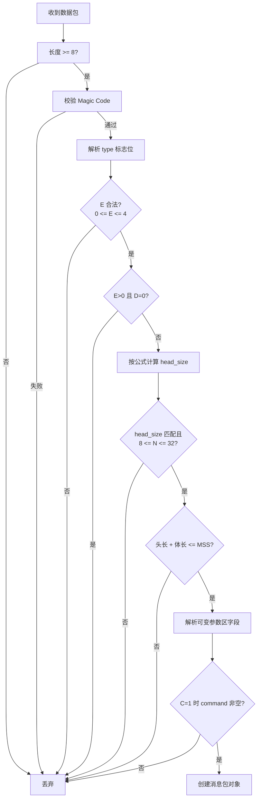
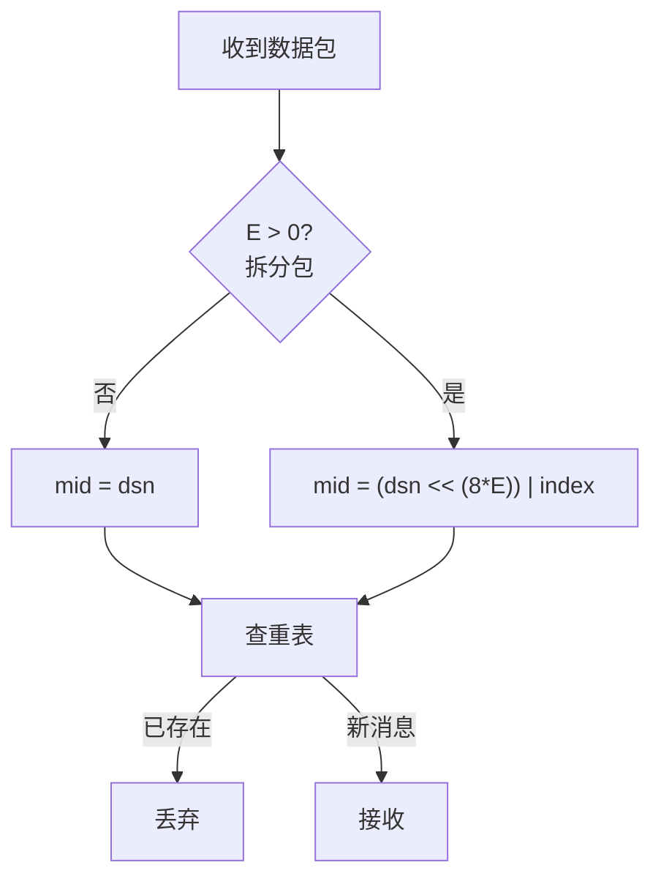

# Magpie Bridge 协议设计

通讯协议由**协议头(head)** 与**协议体(body)** 两部分组成。接收方收到数据包后按协议标准逐项校验，不符合规范即判定为错误包，直接丢弃。

## 1. 数据包结构

```
     0                   1                   2                   3
     0 1 2 3 4 5 6 7 8 9 0 1 2 3 4 5 6 7 8 9 0 1 2 3 4 5 6 7 8 9 0 1
    +-+-+-+-+-+-+-+-+-+-+-+-+-+-+-+-+-+-+-+-+-+-+-+-+-+-+-+-+-+-+-+-+
    |      'M'      |      'P'      |     '\0'      |     '\1'      |
    +-+-+-+-+-+-+-+-+-+-+-+-+-+-+-+-+-+-+-+-+-+-+-+-+-+-+-+-+-+-+-+-+
    |      type     |   head size   |           body size           |
    +-+-+-+-+-+-+-+-+-+-+-+-+-+-+-+-+-+-+-+-+-+-+-+-+-+-+-+-+-+-+-+-+
    |                        target bridge id                       |
    +-+-+-+-+-+-+-+-+-+-+-+-+-+-+-+-+-+-+-+-+-+-+-+-+-+-+-+-+-+-+-+-+
    |                        source bridge id                       |
    +-+-+-+-+-+-+-+-+-+-+-+-+-+-+-+-+-+-+-+-+-+-+-+-+-+-+-+-+-+-+-+-+
    |                       data serial number                      |
    +-+-+-+-+-+-+-+-+-+-+-+-+-+-+-+-+-+-+-+-+-+-+-+-+-+-+-+-+-+-+-+-+
    |           data index          |           data count          |
    +-+-+-+-+-+-+-+-+-+-+-+-+-+-+-+-+-+-+-+-+-+-+-+-+-+-+-+-+-+-+-+-+
    |                            command                            |
    +-+-+-+-+-+-+-+-+-+-+-+-+-+-+-+-+-+-+-+-+-+-+-+-+-+-+-+-+-+-+-+-+
```

> 上图为**最大布局示意**（B/C/D 全置位、E=4 时共 32 字节）；实际字段按标志位依次拼接，偏移随之前移。index/count 宽度由 E 决定（1 ~ 4 字节）。

- 协议头大小 8 ~ 32 字节：前 8 字节固定，后 24 字节为可变参数区；
- 协议体大小 0 ~ 1024 字节（业务上限，见「协议体与 MSS」）；
- 头长度 + 体长度 = 整个数据包总长度 ≤ MSS。

## 2. 协议头

### 2.1 Magic Code（固定 4 字节）

`['M', 'P', '\0', '\1']`，表示 Message Protocol v1。

### 2.2 测量校验区（固定 4 字节）

包含 3 个参数：类型、包头长度、包体长度，用于判断包类型、检查参数长度。

#### Type（1 字节）

高 4 位为标志位，低 3 位为分包参数长度 E：

```
      0   1   2   3   4   5   6   7
    +---+---+---+---+---+---+---+---+
    | A | B | C | D |               |
    | C | I | M | S |    EXT LEN    |
    | K | D | D | N |               |
    +---+---+---+---+---+---+---+---+
```

| 位 | 名称 | Mask | 说明 |
|---|------|------|------|
| A | ACK  | 0x80 | 最高位，应答标志位 |
| B | BID  | 0x40 | 第 2 位，桥接包标志位（4×2 字节 bid） |
| C | CMD  | 0x20 | 第 3 位，是否包含 command（4 字节） |
| D | DSN  | 0x10 | 第 4 位，是否包含序列号（4 字节） |
| E | LEN  | 0x07 | 低 3 位，分包参数 (index, count) 的宽度 |

- **A=1** 应答包：数据应答 COPY 必须 D=1；系统指令应答（SYN!/ACK!/PONG/FIN!）为 D=0；
- **B=1** 服务器桥接包（含握手、要求转发），包头包含 target、source 两个 4 字节 bid；B=0 为客户端直连包，不含 bid 字段；
- **C=1** 包头含有 command（4 字节）；
- **D=1** 包头含有 dsn；D=1 仅用于普通数据包及其数据应答 COPY，系统指令一律 D=0；
- **E** 分包参数 (index, count) 的宽度（字节数），见下节。

#### E 取值与分包规格

| E | 含义 | 覆盖区间 | 打包是否启用 |
|---|------|---------|:---:|
| 0 | 无分包（index=0, count=1，微型包） | ≤ 1024 B | ✅ |
| 1 | index/count 各 1 字节 | 2 ≤ count < 256 | 保留 |
| 2 | index/count 各 2 字节 | 256 ≤ count < 65,536 | ✅ |
| 3 | index/count 各 3 字节 | 65,536 ≤ count < 16,777,216 | 弃用 |
| 4 | index/count 各 4 字节 | 16,777,216 ≤ count < 4,294,967,296 | ✅ |

- E 允许取值 **0 ~ 4**，其余取值（5、6、7）为错误包；
- 实际打包仅用 0/2/4（字节对齐），校验仍允许 0~4；
- **E>0 且 D=0**（有分包参数却无 dsn）判定为错误包；反之 D=0 时 E 必为 0；
- type 第 4 位（0x08）恒为 0，留作未来 flag，打包时恒为 0，**校验时不检查**（校验用 `E = type & 0x07`，不要用 `type & 0x0F`）。

各规格消息/文件包上限（count × 1024）：

| E | 规格 | 标称上限 | 精确上限（标称 − 1 KiB） |
|---|------|---------|--------------------------|
| 1 | 小文件 | 256 KiB | 255 KiB |
| 2 | 普通文件 | 64 MiB | 64 MiB − 1 KiB |
| 3 | 大文件 | 16 GiB | 16 GiB − 1 KiB |
| 4 | 超大文件 | 4 TiB | 4 TiB − 1 KiB |

> E 的区间向下兼容：2 字节可承载 1 字节区间，4 字节可承载 1/2/3 字节区间，校验不锁死区间；达到标称上限时 count 超出当前 E 的表示范围，打包时自动升档（见 calcExt）。

#### 协议头长度（1 字节）

```
    N = 8 + 8*B + 4*D + 2*E + 4*C
```

其中 B/C/D 为标志位取值（0 或 1），E 为分包参数长度（解包时 `E = type & 0x07`）。计算结果应与 1 字节整数表示的协议头长度相等（8 ≤ N ≤ 32），否则为错误包。

#### 协议体长度（2 字节）

头长度 + 体长度 ≤ MSS（= 1232），否则为错误包。

### 2.3 可变参数区

| 顺序 | 变量 | 长度 | 出现条件 |
|:---:|------|------|---------|
| 1 | target bid | 4 B | B=1 |
| 2 | source bid | 4 B | B=1 |
| 3 | serial number (dsn) | 4 B | D=1 |
| 4 | index | E 字节 | E>0 |
| 5 | count | E 字节 | E>0 |
| 6 | command | 4 B | C=1 |

#### Bridge ID

B=1 时携带 target、source 两个 4 字节 bid。服务器收到 B=1 的包并校验通过后，取出 target：不为 0 则原地转发，无需修改数据包；为 0 则表示发给服务器自身（握手/挥手等指令）。B=0 的包若发给服务器会被判为错误包。

#### Serial Number（dsn）

D=1 时携带 4 字节 dsn：对拆分前的原始数据包从 1 开始自增（0 表示无序列号，对应 D=0）。拆分包（E>0）的 dsn 相同，接收方以 dsn+index 拼接去重：

```
if E == 0:
    mid = dsn
else:
    mid = (dsn << (E << 3)) | index
```

即 dsn 左移 `E << 3` 位（E 字节 = index 字段位宽，如 E=2 时左移 16 位），空出的低位存放 index，两者互不重叠，mid 与 (dsn, index) 一一对应；mid 用 64 位无符号整数存储。

dsn 在同一方向（连接/管道）上统一自增；去重仅针对数据包（含应答包），系统指令（D=0）不参与。

#### 分包参数 (index, count)

需要分包时 E>0，index/count 各占 E 字节，其中 **0 ≤ index < count**；无需分包时 E=0，此处为空。

#### Command

C=1 时协议头末尾 4 字节为 command。Command 本质为 **32 位无符号整数，取值范围 1 ~ 4294967295**；除系统保留指令外，应用层可自由使用其余任意值定义自己的指令集。系统指令采用"可读字符串按网络字节序（大端）转整数"的方式定义，如 `"SYN?" = 0x53594E3F`、`"DATA" = 0x44415441`。

数值 0 保留表示空 command（对应 C=0，字段不存在，含义等同 DATA）。

## 3. Command 表

| Value | Flags | Desc |
|-------|-------|------|
| SYN?  | A=0, C=1, D=0, E=0 | 第 1 次握手 |
| SYN!  | A=1, C=1, D=0, E=0 | 第 2 次握手（应答） |
| ACK!  | A=1, C=1, D=0, E=0 | 第 3 次握手（成功连接） |
| FAIL  | A=1, C=1, D=0, E=0 | 失败（服务器分配 bid 失败时使用） |
| DATA  | A=0, D=1 | 普通数据包（C 可 0 可 1） |
| COPY  | A=1, C=1, D=1 | 确认收到（数据应答包） |
| PING  | A=0, C=1, D=0, E=0 | 发起心跳 |
| PONG  | A=1, C=1, D=0, E=0 | 心跳应答 |
| FIN?  | A=0, C=1, D=0, E=0 | 第 1 次挥手 |
| FIN!  | A=1, C=1, D=0, E=0 | 第 2 次挥手（应答） |
| NOOP  | - | 空操作 |
| USER  | - | 用户自定义 |

> 系统指令（SYN?/SYN!/ACK!/PING/PONG/FIN?/FIN!）均为 D=0，不携带 dsn，发送方无需维护等待应答的队列；
> command 为空时含义等同 DATA（默认值）；
> 仅普通数据包及其数据应答 COPY 使用 D=1（需要 dsn 配对确认），因此 **D 位可直接作为"发送后是否需要等待应答"的判据**；
> 如果 C=1，则 command 不能为空，否则判定为错误包；command 具体值是否属于系统指令、如何应答，由服务器管理线程判断。

## 4. 协议体与 MSS

协议体最大不超过 **1024 字节**（最终业务上限）。

- MSS = 1232 为传输层硬性校验上限：任意包 头长度 + 体长度 ≤ MSS（1280 − 40 − 8，IPv6 最小 MTU 下 UDP 载荷极限）；
- 若包体取 1200（1200 + 32 = 1232），IP 数据报恰为 1280 字节，无缓冲余量；
- 取 1024 (1 KiB) 后：IP 数据报 = 1056 + 8 + 40 = **1104 字节**，在 IPv6 最小 MTU 1280 下预留 **176 字节**安全缓冲，可容忍单层/轻量双层隧道（WireGuard 60-80 B、OpenVPN 60-70 B 等），极大概率不被再次分片；
- N=1024 为更保守的业务上限（头 + 体 ≤ 1056 < 1232），与 MSS 硬上限并存不冲突。

## 5. 处理流程

### 5.1 解包校验



### 5.2 分包去重



> 去重仅针对数据包（含应答 COPY）；系统指令（D=0）不参与。
