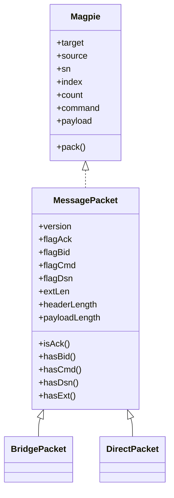
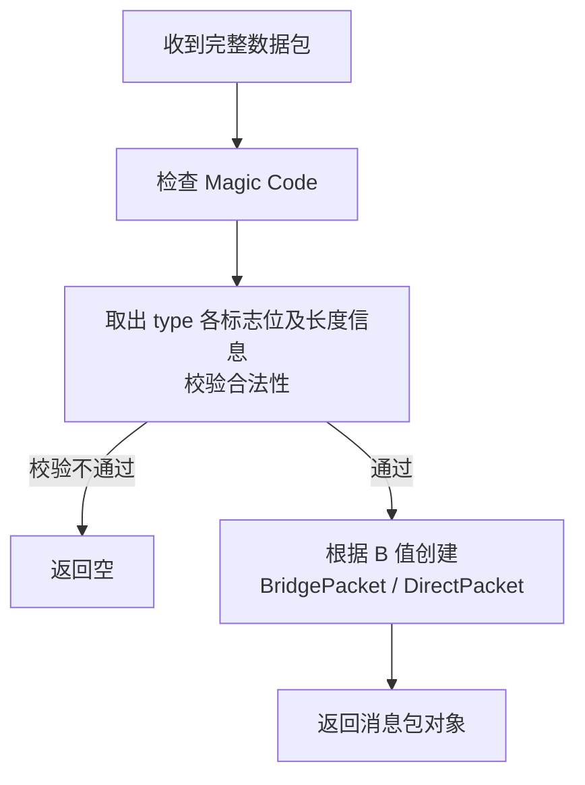

# Magpie SDK（SDK 接口设计）

> 定义基础库的关键接口和类实现，覆盖 Java、Python、Dart 等语言版本。

## 1. 消息包定义

核心消息接口命名为 **Magpie**，基类为 **MessagePacket**——每一个在网络中传输的消息包就是一个 Magpie。

消息包分两大类：

- **BridgePacket（桥接包）**：客户端与服务器相互发送的消息包（包括由服务器中转的消息包），B=1；
- **DirectPacket（直连包）**：客户端之间直接发送的消息包，B=0、无 bid 字段。



### 1.1. 核心接口 Magpie

所有属性均为只读（不含 setter）：

| 属性 | 说明 |
|------|------|
| target | 目标 bid |
| source | 来源 bid |
| sn | 数据序列号 |
| index | 分包编号 |
| count | 分包总数 |
| command | 命令 |
| payload | 数据载荷 |
| pack() | 生成网络字节序数据包 |

### 1.2. 实现类 MessagePacket

扩展属性（只读）：

| 属性 | 说明 |
|------|------|
| version | 协议版本，固定值 "1.0" |
| flagAck | 应答标志位，0 或 1 |
| flagBid | 桥接标志位，0 或 1 |
| flagCmd | 命令标志位，0 或 1（普通数据包默认 0） |
| flagDsn | 序列号标志位，0 或 1 |
| extLen | 额外参数长度：解包时 `E = type & 0x07`（允许 0~4）；打包时仅取 0/2/4 |
| headerLength | 协议头长度，8 - 32 |
| payloadLength | 载荷长度，0 - 1024 |

扩展方法：

| 方法 | 说明 |
|------|------|
| isAck() | 是否为应答包 |
| hasBid() | 是否包含 bid，即是否与服务器通讯 |
| hasCmd() | 是否包含命令（普通数据包默认 false） |
| hasDsn() | 是否包含数据序列号 |
| hasExt() | 是否包含额外分包参数 |

## 2. 消息包工厂

在 BridgePacket 和 DirectPacket 上分别定义静态工厂方法，按协议调用 `create()` 创建各类消息包：

|      | BridgePacket (C-S)          | DirectPacket (C-C)    | 说明                     |
|------|-----------------------------|-----------------------|--------------------------|
| 握手 | syn(source)                 | syn()                 | source 为预订 bid        |
|      | synAck(target, info)        | synAck(info)          | target 为新分配 bid      |
|      | ack(source)                 | ack()                 |                          |
|      | fail(magpie)                | -                     | 失败应答（服务器分配 bid 失败）|
| 发送 | data(target, source, sn, index, count, payload) | data(sn, index, count, payload) |                |
|      | copy(magpie)                | copy(magpie)          | 应答参数从 magpie 复制    |
| 心跳 | ping(source)                | ping()                |                          |
|      | pong(magpie)                | pong(magpie)          | 应答参数从 magpie 复制    |
| 挥手 | fin(source)                 | fin()                 |                          |
|      | finAck(magpie)              | finAck(magpie)        | 应答参数从 magpie 复制    |

**注**：

1. 第一次握手时可填 source 作为预订（期望）bid，可选（0 = 普通申请；非 0 时新建预订须 > 65535，loopback 重握手复用内定 bid 除外）；预订失败（被占用/非法/服务器已满）时服务器回复 FAIL 指令包，由客户端自行决定重新申请或放弃；
2. 除了"发送"消息包之外（因已被 payload 占用），其余各命令在实现时均可携带一个可选参数 `info` 放在载荷当作附加信息；
3. 其中 synAck 命令的 info 为当前客户端的 socket 信息，其余命令的 info 暂时都为空；
4. 以上方法返回对象均为 MessagePacket，标志位和字段值默认按协议规定设置。

## 3. 消息包解析器

接收到完整的数据包之后，由解析器 **Message Parser** 进行校验解析。



### 解析器接口 Parser

```
接口方法： parse(data)
```

1. 根据协议一次检查 Magic Code、取得 type 中的各项标志位以及长度等信息，对数据合法性进行校验；
2. 如果数据包校验不通过，则返回空；否则用解析出来的所有参数，根据 B 的值创建对应的消息包对象并返回（B=1 时创建 BridgePacket，B=0 时创建 DirectPacket）。

## 4. 计算公式（示例）

```
calcType(act, bid, cmd, dsn, ext) = (act << 7) | (bid << 6) | (cmd << 5) | (dsn << 4) | (ext & 0x07)

calcHeaderLength(bid, cmd, dsn, ext) = 8 + 8*bid + 4*dsn + 2*ext + 4*cmd

calcPayloadLength(payload) = payload.length

calcCmd(command)     = command == 0 ? 0 : 1
calcDsn(sn)          = sn == 0 ? 0 : 1
calcExt(count)       = count >= 65536 ? 4 : count >= 2 ? 2 : 0
```

## 5. 工程目录

| 语言 | 工程根目录 | 依赖版本 |
|------|-----------|----------|
| Java | `magpie-bridge/sdk-java/` | Java 8，name = 'Magpie'，group = 'io.github.moky' |
| Python | `magpie-bridge/sdk-py/` | Python >= 3.6，name = 'magpie-bridge' |
| Dart | `magpie-bridge/sdk-dart/` | sdk '>=3.0.0 <4.0.0'，name: magpie-bridge |

Python 代码目录：`magpie_bridge/protocol/`（协议定义）、`magpie_bridge/magpie/`（工具类）。
