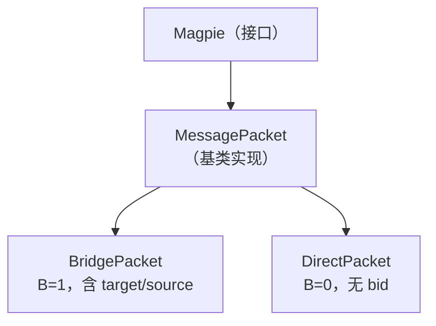
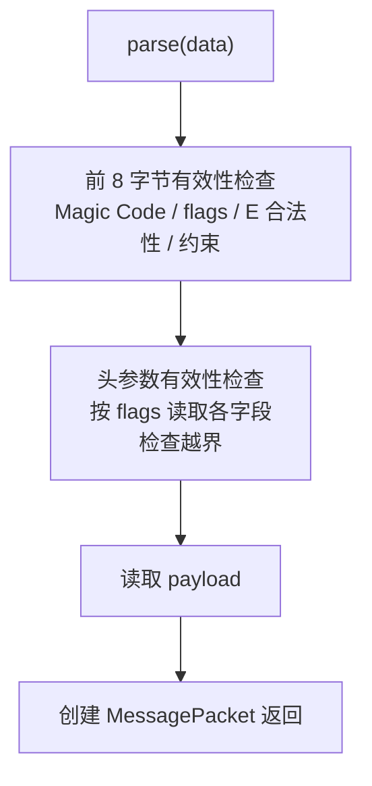

# Magpie Bridge SDK 设计

SDK 定义基础库的关键接口和类实现，提供 Java、Python、Dart 等多个语言版本。

## 1. 消息包类型

核心消息接口命名为 **Magpie**，基类为 **MessagePacket**（网络中的每个消息包即一个 Magpie）。消息包分两大类：

- **BridgePacket**（桥接包，B=1）：客户端与服务器相互发送的消息包（含服务器中转的消息包）；
- **DirectPacket**（直通包，B=0）：客户端之间直接发送的消息包，无 bid 字段。



### 1.1 核心接口 Magpie

所有属性只读（不含 setter）：

| 属性 | 说明 |
|------|------|
| target | 目标 bid |
| source | 来源 bid |
| sn | 数据序列号（dsn） |
| index | 分包编号 |
| count | 分包总数 |
| command | 命令 |
| body | 数据体 payload |

方法：`pack()` 生成网络字节序数据包。

### 1.2 实现类 MessagePacket

扩展属性（只读）：

| 属性 | 说明 |
|------|------|
| version | 协议版本，固定 "1.0" |
| flagAck | 应答标志位（0/1） |
| flagBid | 桥接标志位（0/1） |
| flagCmd | 命令标志位（0/1，普通数据包默认 0） |
| flagDsn | 序列号标志位（0/1） |
| extLen | 额外参数长度（E = type & 0x07，允许 0~4；打包仅取 0/2/4） |
| headSize | 包头大小（8 ~ 32） |
| bodySize | 包体大小（0 ~ 1024） |

扩展方法：`isAck`、`hasBid`（是否与服务器通讯）、`hasCmd`、`hasDsn`、`hasExt`。

## 2. 数据报工厂

在 BridgePacket 和 DirectPacket 上分别定义静态工厂方法，按协议调用 `MessagePacket.create()` 创建消息包：

| | BridgePacket (C-S) | DirectPacket (C-C) | 说明 |
|---|--------------------|--------------------|------|
| 握手 | syn(source) | syn() | source 为预订 bid |
| | synAck(target, info) | synAck(info) | target 为新分配 bid |
| | ack(source) | ack() | |
| | fail(magpie) | - | 失败应答（服务器分配 bid 失败时使用） |
| 发送 | data(target, source, sn, index, count, body) | data(sn, index, count, body) | |
| | copy(magpie) | copy(magpie) | 应答参数从 magpie 复制 |
| 心跳 | ping(source) | ping() | |
| | pong(magpie) | pong(magpie) | 应答参数从 magpie 复制 |
| 挥手 | fin(source) | fin() | |
| | finAck(magpie) | finAck(magpie) | 应答参数从 magpie 复制 |

注：

1. 第一次握手可填 source 作为预订（期望）bid，可选（0 = 普通申请；非 0 新建预订须 > 65535，loopback 重握手复用内定 bid 除外）；预订失败（被占用/非法/服务器已满）时服务器回复 FAIL，由客户端自行决定重新申请或放弃；
2. 除"发送"数据报外（body 被占用），其余各命令均可携带可选参数 info 放在协议体作附加信息；
3. 其中 synAck 的 info 为当前客户端 socket 信息，其余命令的 info 默认为空（fail/pong/finAck 默认回显请求包 body）；
4. 以上方法返回对象均为 MessagePacket，标志位和字段值默认按协议规定设置。

## 3. 数据报解析器

收到完整数据包后由解析器 MessageParser 校验解析，接口方法 `parse(data)`：

1. 依次检查 Magic Code，取得 type 各项标志位及长度信息，校验数据合法性；
2. 校验不通过返回空；通过则用解析出的参数创建 MessagePacket 实例返回。



> 解析时校验约束：E>0 时 D 必须为 1（D=0 且 E>0 判定为错误包）；C=1 时 command 必须非空。

## 4. 计算公式（Dart 示例）

```dart
static int calcType({
    required int act,
    required int bid,
    required int cmd,
    required int dsn,
    required int ext,
}) => (act << 7) | (bid << 6) | (cmd << 5) | (dsn << 4) | (ext & 0x07);

static int calcHeadSize({
    required int bid,
    required int cmd,
    required int dsn,
    required int ext,
}) => 8 + 8 * bid + 4 * dsn + 2 * ext + 4 * cmd;

static int calcBodySize(Uint8List? body) => body?.length ?? 0;

static int calcCmd({required int command}) => command == 0 ? 0 : 1;

static int calcDsn({required int sn}) => sn == 0 ? 0 : 1;  // sn == 0 表示无 dsn（系统指令），数据包 sn 从 1 开始自增

static int calcExt({required int count}) {
    if (count >= 65536) {
        return 4;
    } else if (count >= 2) {
        return 2;
    } else {
        assert(count == 1, 'packet count error: $count');
        return 0;
    }
}
```

## 5. 工程目录

SDK 包括 Java、Python、Dart 等多个语言版本，其中 Python 版服务器与 Python 版 SDK 共用一个库 `magpie-bridge`。

| 语言 | 依赖 | 工程参数 | 根目录 |
|------|------|---------|--------|
| Java | Java 8 | name='Magpie', group='io.github.moky' | magpie-bridge/sdk-java/ |
| Python | Python >= 3.6 | name='magpie-bridge' | magpie-bridge/sdk-py/ |
| Dart | sdk: '>=3.0.0 <4.0.0' | name: magpie-bridge | magpie-bridge/sdk-dart/ |

Python 代码目录：`magpie_bridge/protocol/`（协议定义）、`magpie_bridge/magpie/`（工具类）。
