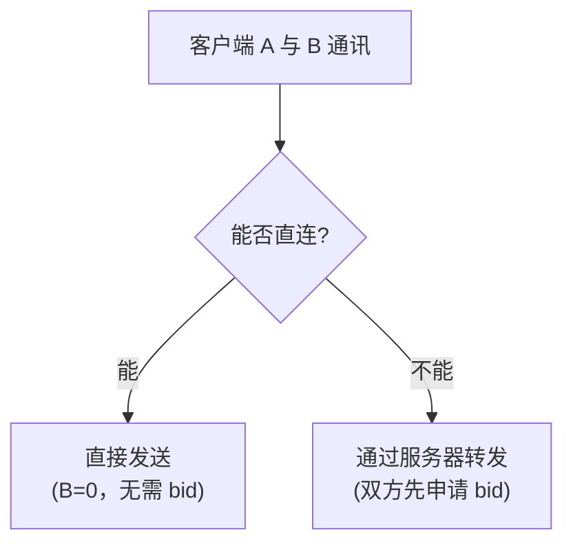
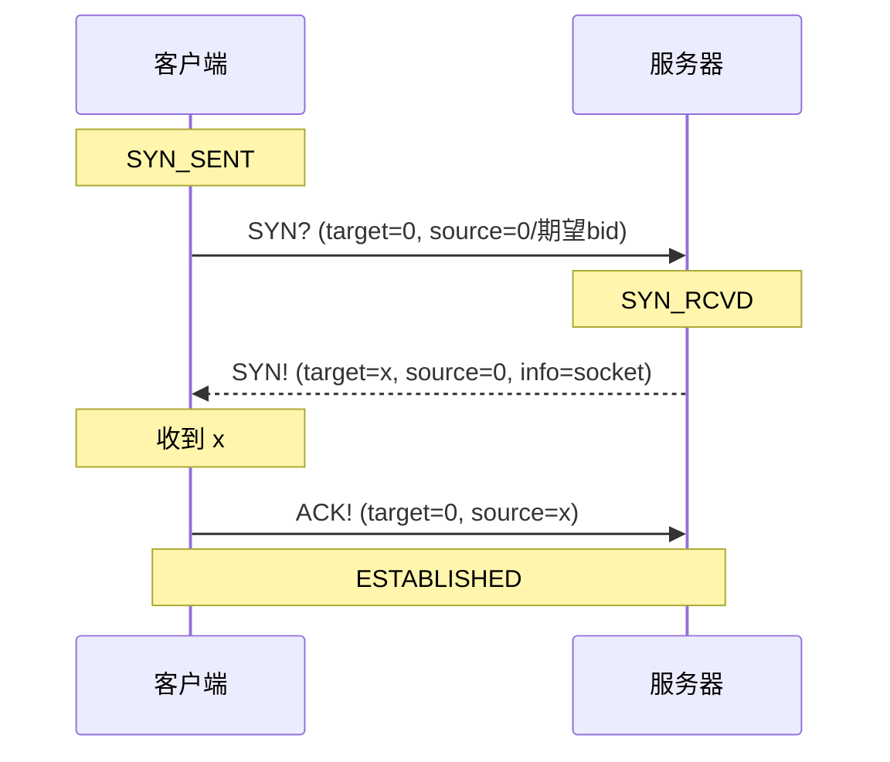
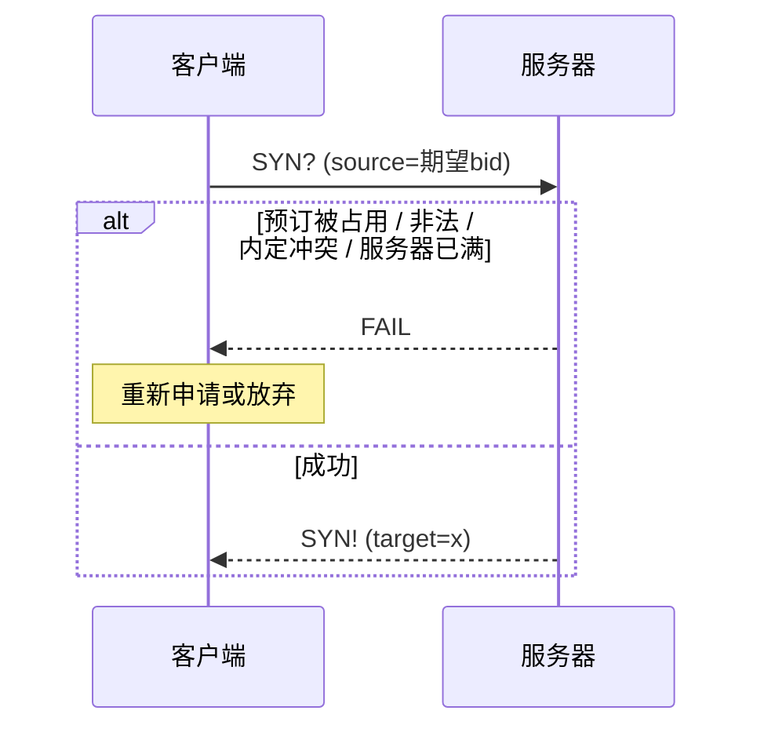
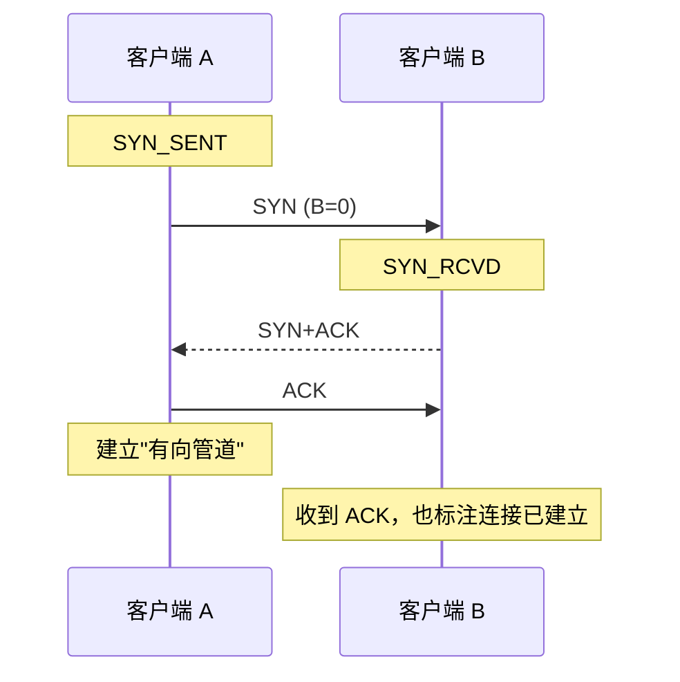
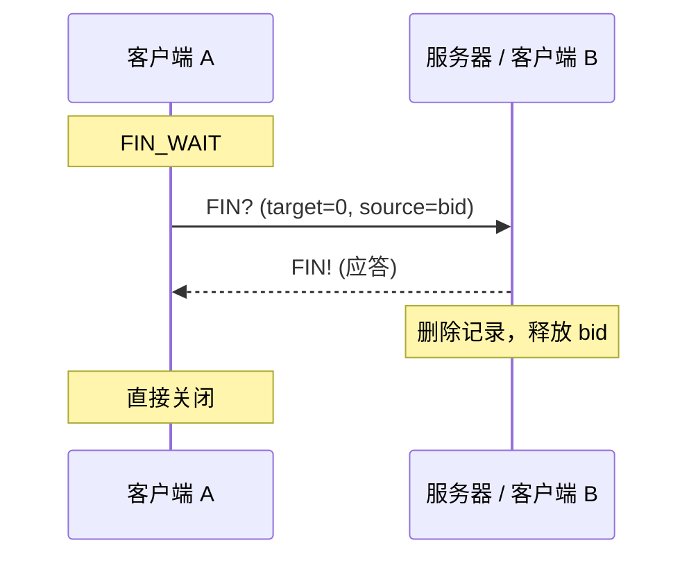
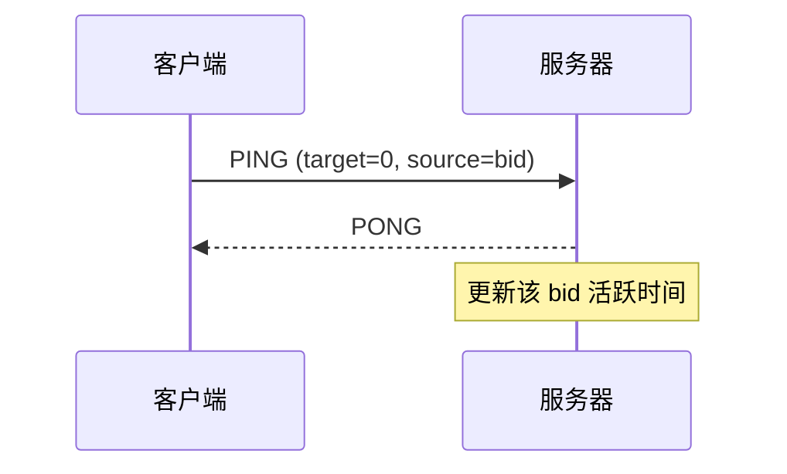
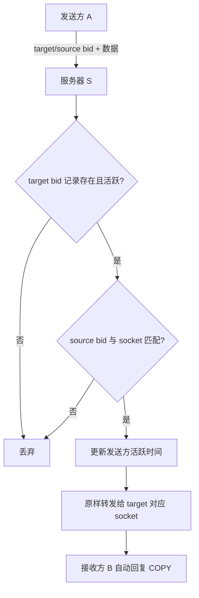

# Magpie Bridge 工作流设计

主要角色为**客户端**与**转发服务器**。两个客户端若能直连则优先直连，否则通过服务器转发；转发服务器彼此独立，客户端根据连通速度自行选择。

## 1. 通讯模式选择

## 2. 握手机制（搭桥）

客户端向服务器申请 bid（Bridge ID，门牌号）；客户端直连无需 bid，但仍需握手建立"连接"。握手共 3 步：

| 步骤 | Flags | Command | DSN |
|------|-------|---------|-----|
| 第 1 次 | A=0, C=1, D=0, E=0 | "SYN?" | - |
| 第 2 次 | A=1, C=1, D=0, E=0 | "SYN!" | - |
| 第 3 次 | A=1, C=1, D=0, E=0 | "ACK!" | - |
| 失败 | A=1, C=1, D=0, E=0 | "FAIL" | - |

> 失败行：服务器 bid 分配失败（预订被占用/非法、内定冲突、服务器已满）时以 FAIL 应答，由客户端自行决定重新申请或放弃。
> B=1 表示与服务器握手；客户端直连握手时 B=0。

系统指令不携带 dsn（D=0），应答的配对依靠 socket 完成：从哪个 socket 收到请求，就向哪个 socket 回复；服务器场景下 source bid 仅用于身份校验（验证 bid 与 socket 的绑定关系），不参与应答寻址。发送方无需维护等待应答的队列。

### 2.1 客户端 → 服务器

- 第 1 次握手：target=0，source 一般为 0（若使用预订机制可预设期望 bid）；
- 第 2 次握手：target 为服务器分配的整数 x，source=0（来自服务器）；可附带客户端 socket 信息（如包体 `{"UDP":"12.34.56.78:12345"}`）；
- 第 3 次握手：target=0（发给服务器），source=x；服务器验证无误后将 x 与 socket(ip:port) 一起指派给转发线程，双方进入 ESTABLISHED。

分配失败分支：

### 2.2 客户端 → 客户端（直连）

A 收到 SYN+ACK 并发出 ACK 后即可在本地标注连接已建立（一条"有向管道"）；B 收到该 ACK 时也标注连接已建立，双方各管理一个单向"连接"。

### 2.3 关于 bid

服务器即"桥"：客户端首次连接时分配整数 bid（门牌号）。客户端需通过其他方式广播 bid，发送方在 target bid 填目标号码，服务器从注册表找到对应 socket 转发。

- target=0：服务器认为发给自身（握手/挥手过程）；
- source=0：只可能是服务器下发的包；若客户端向服务器发 source=0 而 target≠0，或 source bid 与服务器记录（按 socket 查找）不匹配，均判为非法丢弃；
- target、source 均非 0：服务器分别查询两个 bid，不正确直接丢弃，正确则原样转发（不做任何改动）。

## 3. 挥手机制（关闭连接）

连接有超时机制判断存活，也可主动挥手直接关闭。单条有向管道的挥手只有 2 步（FIN? / FIN!）：

| 步骤 | Flags | Command | DSN |
|------|-------|---------|-----|
| 第 1 次 | A=0, C=1, D=0, E=0 | "FIN?" | - |
| 第 2 次 | A=1, C=1, D=0, E=0 | "FIN!" | - |

- 主动关闭：A 发送 FIN，表示关闭自己这一侧，进入 FIN_WAIT；
- 被动关闭：对方收到后回复 FIN!，然后直接关闭；
- A 收到 FIN!（或等待 2MSL 仍未收到）则直接关闭；
- 直连场景两条"有向管道"各自独立挥手，总体类似 TCP 4 次挥手。

## 4. 心跳机制（保活）

客户端定期检查自身发送时间，若超过预设时间无任何数据包发送（含应答），则主动发送心跳维持"连接"状态。

| 步骤 | Flags | Command | DSN |
|------|-------|---------|-----|
| 1 | A=0, C=1, D=0, E=0 | "PING" | - |
| 2 | A=1, C=1, D=0, E=0 | "PONG" | - |

> 心跳包发给服务器时 B=1；直连时 B=0。服务器无需主动发起心跳：C-S 结构的连接状态由客户端负责维护；直连场景两条管道分别由各自发起方维护。

## 5. 发送机制

### 5.1 通过服务器转发

| 序号 | Flags | Command | DSN | index, count |
|------|-------|---------|-----|--------------|
| 1 | A=0, B=1, C=0, D=1 | - | 自增值 | 实际分片信息 |
| 1 | A=0, B=1, C=1, D=1 | "DATA" | 自增值 | 实际分片信息 |

> 服务器检查 target 是否活跃（规定时间 T 内有上行数据包；T 为"在线"判定窗口，一般小于 2 分钟，与超时回收时效 expires 无关），同时检查 source bid 与当前 socket 是否匹配。
> 服务器协助转发时无需向发送方回复应答包，发送方通过接收方自动回复的应答包确认收到。

### 5.2 直接发送

| 序号 | Flags | Command | DSN | index, count |
|------|-------|---------|-----|--------------|
| 2 | A=0, B=0, C=0, D=1 | - | 自增值 | 实际分片信息 |
| 2 | A=0, B=0, C=1, D=1 | "DATA" | 自增值 | 实际分片信息 |

两个客户端经握手建立"连接"后，直接打包发送（B=0，无 bid 字段）。

## 6. 应答机制

客户端收到普通数据包（A=0, D=1，command 为 "DATA" 或无 command）时，均需回复数据应答包 "COPY"（A=1, D=1，回填源 dsn 及 index/count）；系统指令（D=0）不回复 COPY，而是回复各自的专用应答（SYN!/PONG/FIN!，失败场景回复 FAIL）。

| 序号 | Flags | Command | DSN | index, count |
|------|-------|---------|-----|--------------|
| 1 | A=1, B=1, C=1, D=1 | "COPY" | 源值 | 源分片信息 |
| 2 | A=1, B=0, C=1, D=1 | "COPY" | 源值 | 源分片信息 |

参数设置：

1. A 置 1（`type = type | 0x80`），表示应答；
2. 若 B=1（经服务器转发），target 与 source 对调发回同一服务器中转；
3. C 置 1，command 字段设为 "COPY"；
4. 若 D=1，dsn 及可能存在的 index/count 保持不变；
5. 标志位 B/D/E 不变；
6. 数据包体为空，也可携带自定义信息。
