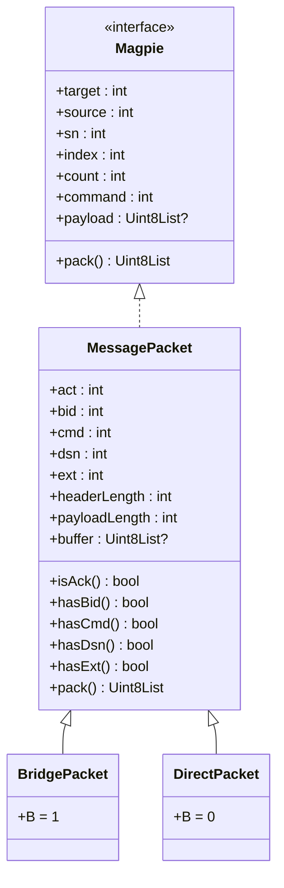

# Magpie SDK 设计与工程

这里定义基础库的关键接口和类实现，SDK 包括 Java、Python、Dart 等多个语言版本，其中 Python 版服务器与 Python 版 SDK 共用一个库 'magpie-bridge'。

## 消息包模型

核心消息接口命名为 **Magpie**，其基类为 **MessagePacket**，即每一个在网络中传输的消息包就是一个 Magpie。

消息包分两大类：

- **BridgePacket（桥接包）**：客户端与服务器相互发送的消息包（包括由服务器中转的消息包），标志位 B=1，协议头含 (target, source) 两个 bid；
- **DirectPacket（直连包）**：客户端之间直接发送的消息包，标志位 B=0，协议头不含 bid 字段。



### 核心接口 Magpie

所有属性均为只读（不含 setter）：

- 属性（只读）
	- target  : 目标 bid
	- source  : 来源 bid
	- sn      : 数据序列号
	- index   : 分包编号
	- count   : 分包总数
	- command : 命令
	- payload : 数据载荷
- 方法
	- pack()  : 生成网络字节序数据包

### 实现类 MessagePacket

所有属性均为只读（不含 setter）：

- 扩展属性（只读）
	- version      : 协议版本，固定值 "1.0"
	- flagAck      : 应答标志位，取值范围 0 或 1
	- flagBid      : 桥接标志位，取值范围 0 或 1
	- flagCmd      : 命令标志位，取值范围 0 或 1（普通数据包默认取 0）
	- flagDsn      : 序列号标志位，取值范围 0 或 1
	- extLen       : 额外参数长度，解包时 E = type & 0x07（低 3 位），允许 0~4；打包时为字节对齐仅取 0/2/4
	- headerLength : 协议头长度，取值范围 8 - 32
	- payloadLength: 载荷长度，取值范围 0 - 1024（**发送端构造约束**；解析端不以此拒绝，只校验 MSS）
- 扩展方法
	- isAck : 是否为应答包
	- hasBid: 是否包含 bid（门牌号），即是否与服务器通讯
	- hasCmd: 是否包含命令（普通数据包默认为 false）
	- hasDsn: 是否包含数据序列号
	- hasExt: 是否包含额外分包参数

> 所有 MessagePacket 一旦创建就不会再改变：创建时可将收到的原始二进制数据存入 buffer，pack() 若已有 buffer 则直接返回，无需二次序列化。

## 消息包工厂

在两个工具接口 BridgePacket 和 DirectPacket 上分别定义所对应的静态工厂方法，根据协议调用 create() 创建各类消息包：

|     | BridgePacket (C-S)   | DirectPacket (C-C)   | 说明                 |
|-----|----------------------|----------------------|---------------------|
| 握手 | syn(source)          | syn()                | source 为预订 bid    |
|     | synAck(target, info) | synAck(info)         | target 为新分配 bid  |
|     | ack(source)          | ack()                |                     |
|     | fail(target, info)   | -                    | 失败应答             |
| 发送 | data(target, source, sn, index, count, payload) | data(sn, index, count, payload) | |
|     | copy(magpie)         | copy(magpie)         | 应答参数从 magpie 复制 |
| 心跳 | ping(source)         | ping()               |                     |
|     | pong(magpie)         | pong(magpie)         | 应答参数从 magpie 复制 |
| 挥手 | fin(source)          | fin()                |                     |
|     | finAck(magpie)       | finAck(magpie)       | 应答参数从 magpie 复制 |

注：

1. 第一次握手时可填 source 作为预订（期望）bid，可选（0 = 普通申请；非 0 时新建预订须 > 65535，loopback 重握手复用内定 bid 除外）；预订失败（被占用/非法/服务器已满）时服务器回复 "FAIL" 指令包，由客户端自行决定重新申请或放弃；
2. 除了"发送"消息包之外（因已被 payload 占用），其余各命令在实现时均可携带一个可选参数 info 放在载荷当作附加信息；
3. 其中 synAck 命令的 info 为当前客户端的 socket 信息；pong/finAck 默认回填原包载荷；fail 的 info 按场景区分（bid 分配失败时为空、连接未确认时为 socket 信息）；其余命令的 info 默认空；
4. 以上方法返回对象均为 MessagePacket，标志位和字段值默认按协议规定设置。

## 消息包解析器

接收到完整的数据包之后，由解析器 Message Parser 进行校验解析。

### 解析器接口 Parser

接口方法：`parse(data)`

1. 根据协议一次检查 Magic Code、取得 type 中的各项标志位以及长度等信息，对数据合法性进行校验；
2. 如果数据包校验不通过，则返回空，否则用解析出来的所有参数，根据 B 的值创建对应的消息包对象并返回（B=1 时创建 BridgePacket，B=0 时创建 DirectPacket）。

解析校验步骤：

1. **前 8 个字节的有效性检查**
	- 检查 Magic Code；
	- 读出 flags（bid = (type >> 6) & 0x01），检查 E 合法性：E = type & 0x07（低 3 位，bit 3 不检查）；E 只允许 0~4，取值 5/6/7 判定为错误包；
	- 检查约束：E>0 时 D 必须为 1（D=0 且 E>0 判定为错误包）；
	- 读出 headerLength 和 payloadLength，然后与 flags 一起计算检查头长度合法性；
2. **头参数的有效性检查**
	- 根据 flags 指示依次读出 target, source, sn, index, count, command 等参数；
	- 检查各项参数是否越界；
	- 若 C=1，则 command 必须非 0（全 0 判定为错误包）；不校验 command 的具体取值（是否系统指令由上层判断）；
3. **读取 payload，然后创建消息包对象**（bid == 0 → DirectPacket，否则 BridgePacket）。

## 计算公式

```dart
static int calcType({
    required int act,
    required int bid,
    required int cmd,
    required int dsn,
    required int ext,
}) => (act << 7) | (bid << 6) | (cmd << 5) | (dsn << 4) | (ext & 0x07);

static int calcHeaderLength({
    required int bid,
    required int cmd,
    required int dsn,
    required int ext,
}) => 8 + 8*bid + 4*dsn + 2*ext + 4*cmd;

static int calcPayloadLength(
    Uint8List? payload
) => payload?.length ?? 0;

static int calcCmd({
    required int command
}) => command == 0 ? 0 : 1;

static int calcDsn({
    required int sn
}) => sn == 0 ? 0 : 1;  // sn == 0 表示无 dsn（系统指令），数据包 sn 从 1 开始自增

static int calcExt({
    required int count
}) {
    if (count >= 65536) {
        return 4;
    } else if (count >= 2) {
        return 2;
    } else {
        assert(count == 1, 'packet count error: $count');
        return 0;
    }
}
```

## 工程目录

SDK 包括 Java、Python、Dart 等多个语言版本，其中 Python 版服务器与 Python 版 SDK 共用一个库 'magpie-bridge'。

### Java SDK

依赖版本：
> Java 8

工程配置参数：
    name = 'Magpie'
    group = 'io.github.moky'

工程根目录：
    magpie/sdk-java/

### Python SDK

依赖版本：
> Python: >= 3.6

工程配置参数：
    name='magpie-bridge'

工程根目录：
    magpie/sdk-py/

代码目录：
    magpie/sdk-py/magpie_bridge/protocol/
    magpie/sdk-py/magpie_bridge/magpie/

协议定义相关的代码放在 protocol/ 目录下，工具类代码放在 magpie/ 下。

### Dart SDK

依赖版本：
> sdk: '>=3.0.0 <4.0.0'

工程配置参数：
    name: magpie-bridge

工程根目录：
    magpie/sdk-dart/
