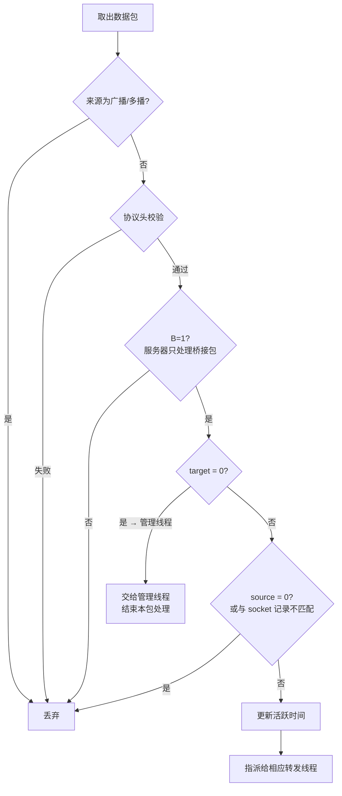
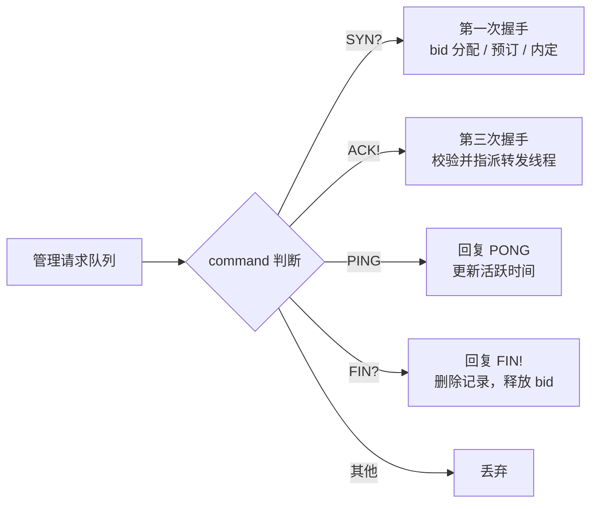
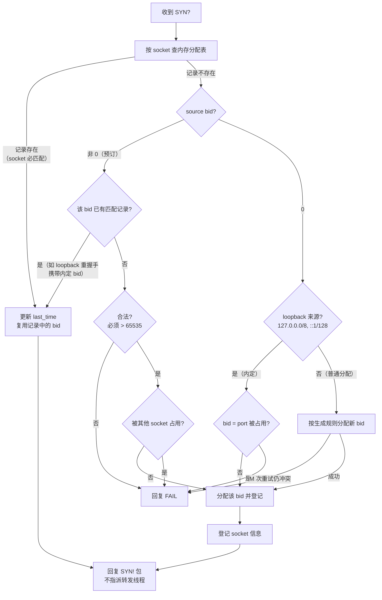
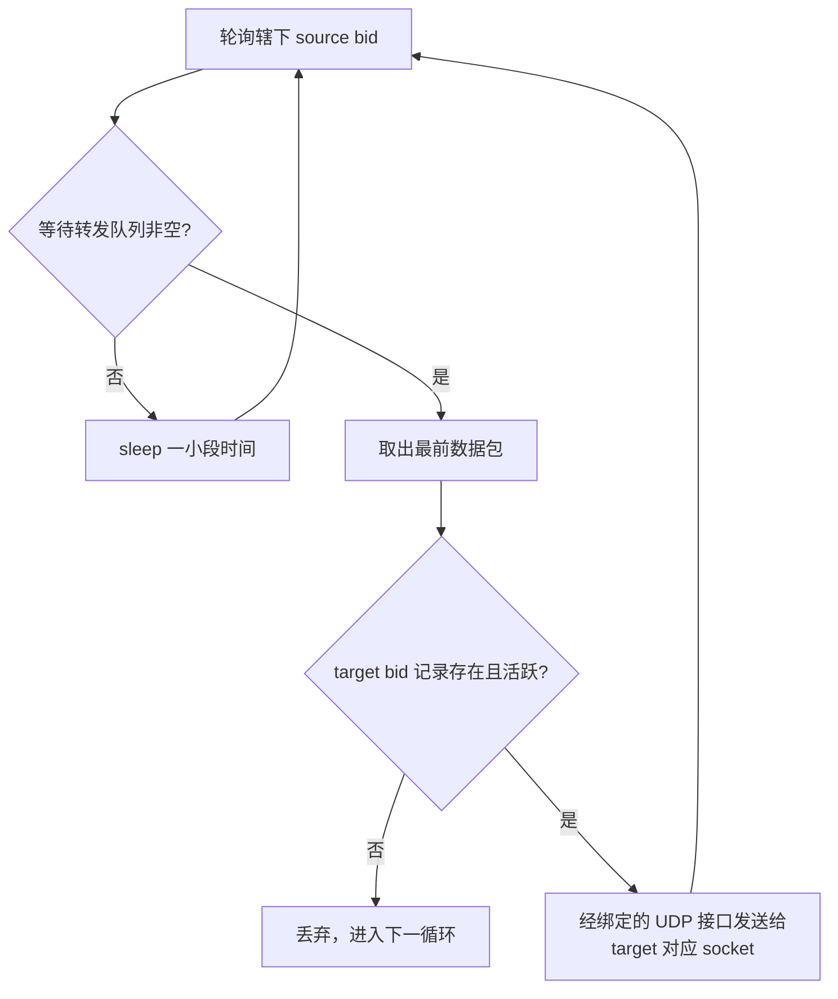
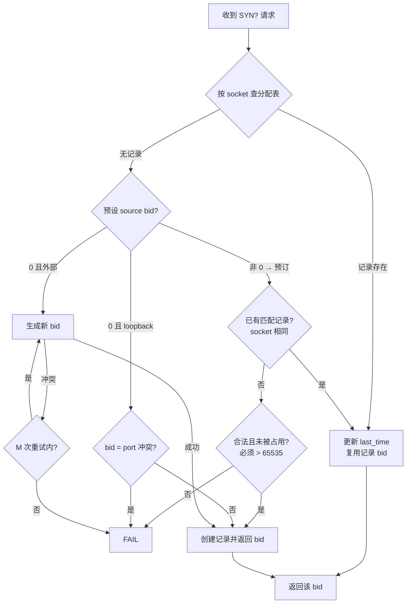

# Magpie Bridge Server（服务器设计）

> 对应 design/220-dev-server.md，为 FSD 服务器分册：服务器内部实现规格（线程详细设计、Bridge ID 管理、工程目录）。
> 系统架构总览见 architecture.md。

## 1. 模块（线程）设计

服务器内部逻辑**收发分离**：接收和转发各由独立线程处理，内存中维护一张 `bid -> socket 信息` 映射表 **yellow_pages**。

| 线程 | 数量 | 职责 |
|------|------|------|
| 接收线程 | 1 | 收包入队，不做任何判断 |
| 预处理线程 | 1 | 协议头校验、bid 匹配，分流管理/转发 |
| 管理线程 | 1 | bid 分配 / 回收（purge）/ 系统命令应答 |
| 转发线程 | W（默认 8） | 按 source bid 分流并转发 |

### 1.0 接收线程

- 绑定一个 UDP 端口接收数据包，不做任何判断，直接连同 socket 信息塞进预处理线程的等待列表；
- UDP 只绑定一个端口，不随用户数增加 fd 占用。

### 1.1 预处理线程

从等待处理队列取出数据包，校验内容（共 6 项）：

1. **来源 IP 为广播或多播地址**（IPv4 224.0.0.0/4 与 255.255.255.255、IPv6 ff00::/8 等）直接丢弃，不应答、不转发；正常数据包的来源地址不可能是广播/多播地址，此类来源多为伪造，若不丢弃，服务器向其应答/转发会使数据扩散到整个广播域或多播组，形成**放大攻击**；
2. Magic Code；
3. Type、header length、payload length，以及相互关系；
4. 将**实际数据包的长度**与根据上面各字段计算得到的值进行比较；
5. **不需要校验 command 具体值**（command 校验是管理线程的职责）；
6. **bid 组合上行校验**：source bid = 0 且 target bid ≠ 0 时判定为上行校验违规（客户端不得伪造服务器下发包），直接丢弃（SDK 解析器不据此拒绝，所以服务器需要校验此处）。



> 备注：source bid 为 0 时 target bid 也必定为 0（仅第一次握手包）；若 source=0 而 target≠0，属于上行校验违规，按上第 6 项处理。

### 1.2 管理线程

职责：

- 从管理请求队列取包，检查 command 及 source bid 后分派处理；
- 队列为空（空闲）时调用 `purge(now)` 回收超时 bid 记录。

校验规则：

- command = "SYN?" 时为第一次握手，**唯一允许 source bid 无内存记录的场景**；
- 其他 command 时 source bid 必须与内存记录（socket 信息）匹配，然后根据 command 值进行相应处理和应答；
- 无法识别（未知 command）直接丢弃。



**2.0 第一次握手（command = "SYN?"）**



- 复用：按 socket 查到已有记录时，更新 last_time 后直接复用该 bid（无需重新登记、无需检查 source bid），同样回复 "SYN!"；
- 预订：source bid 非 0 时一律走预订流程（无论是否 loopback）；
- 内定：loopback 且 source=0 时，按 `bid = port` 内定规则分配；
- 普通分配：外部来源且 source=0 时，按生成规则分配新 bid；
- 所有失败场景统一回复 "FAIL" 指令包，由客户端自行决定重新申请或放弃。

**2.1 第三次握手（command = "ACK!"，source bid > 0 必须）**

取出 source bid 与内存记录比较：socket 不匹配直接丢弃；一致则更新活跃时间并指派转发线程。

**2.2 心跳包（command = "PING"，source bid > 0 必须）**

按协议标准回复 "PONG"，同时更新活跃时间。

**2.3 挥手（command = "FIN?"，source bid > 0 必须）**

先回复 "FIN!" 指令包（挥手应答），然后删除记录，释放 bid。

### 1.3 转发线程（W 条，默认 W=8）

绑定地址、端口与转发线程数均为配置文件参数（见 4 节），命令行参数见 4.1 节（均可选；未知参数打印用法后退出）。

- 预处理线程分配任务前计算 `n = (source bid) % W`，指派给第 n 条线程；
- 每条转发线程为辖下每个 source bid 创建等待转发队列；
- 轮询任务采用**广度优先**策略：轮询辖下所有 source bid，避免单个用户发送大量数据严重干扰其他用户的正常请求；若所有 bid 均无等待任务，则 sleep 一小段时间后继续下一循环。



> 转发链路共检查**两个 bid**：预处理线程已校验 source bid 与 socket 信息匹配；转发线程发送前校验 source bid 已完成第三次握手（ACK!，连接未确认时以 "FAIL" 载荷带 socket 信息通知客户端并丢弃）且 target bid 记录存在并活跃。只有两个 bid 均匹配才会转发。

**流量控制**：为避免流量风暴，转发线程设置限流（每个限流窗口内最多处理 `forward_limit_per_window` 个任务，默认 1024，窗口时长 `forward_window` 默认 0.1 秒，均可在配置文件中调整）；任务分散到 W=8 条线程，单条线程达到上限不影响其他线程，将风暴限制在小影响范围。

## 2. Bridge ID 管理

### 2.1. bid 结构

bid 为 32 位无符号整数，由高 16 位 H 与低 16 位 L 合并：

| H 区间 | 含义 |
|--------|------|
| 0 | 内定保留区间（bid = port，给 loopback 内部进程） |
| 1 ~ 32767 | 当前启用的普通分配与预订区间 |
| 32768 ~ 65535 | 预留区间（合法但不自动分配，仅可能由客户端预订产生） |

socket 信息包括 ip 和 port，作为 key 时为 `"{ip}:{port}"` 字符串。设计要求：**bid 与 socket 信息一一对应**。

### 2.2. 生成规则

1. 内部私有变量 n 初始为 1，最大 32767；
2. 每次生成取 H = n（随后 n+1，超最大值回到 1）；
3. 每次生成取 L = r（随机整数 0 ~ 65535）；
4. `bid = (H << 16) | L`；
5. 检查分配表，冲突则回到步骤 2 重试；
6. 重试达 M 次（默认 M=16，可通过配置文件 `bid_allocation_retries` 调整）仍冲突，表示服务器已满，回复 "FAIL"。

> 服务器自动分配时 H 仅在 1 ~ 32767 循环，不会自动分配 H ≥ 32768 的 bid（该预留区间仅可能由客户端预订产生，见 2.6）。

### 2.3. 冲突判定

通过 bid 查询：记录不存在，或记录 socket 信息相同 → 无冲突；记录 socket 信息不同 → 冲突。

> 记录回收仅由管理线程在空闲时通过 purge 完成，其他线程不做超时覆盖判断（记录存在即认定为冲突）。

### 2.4. 内存分配表

- 以 bid 为 key，或以记录中的 key 为 key，均可查询分配记录；
- 记录字段：bid、key、socket 信息、last_time（最后活跃时间）、acknowledged（是否已完成第三次握手 ACK!，置位后连接才算 established）；
- 每次收到数据包并检查通过后更新 last_time；只有预处理线程和管理线程更新 last_time，转发线程不需要（指派前已更新）。

> 记录中的 key 为 socket 信息字符串 "{ip}:{port}"，创建记录时生成一次即可；由于 ip 和 port 固定不变，后续查询时直接取用该字段，无需每次重新拼接。

### 2.5. 分配与回收



- 每次新建分配记录时，同时建立 bid、socket 信息两个索引指向该记录；
- **回收（purge）**：管理线程空闲时调用 `purge(now)`，删除所有 `last_time < now - expires` 的记录（同时删除两个索引），回收 bid；
- 回收时效默认 `expires = 3600 * 24`（24 小时，可通过配置文件 `record_expires` 调整）；`purge(now)` 调用间隔默认不小于 10 分钟（可通过配置文件 `record_recycle_interval` 调整）；
- 在线判定窗口 T（默认 2 分钟，可通过配置文件 `record_active_timeout` 调整）与回收时效 expires（默认 24 小时）是两个不同参数：T 用于转发线程判断记录是否活跃，expires 用于管理线程回收超时记录。

### 2.6. 内定与预订机制

- **内定**：loopback（127.0.0.0/8, ::1/128）来源且第一次握手 source=0 的客户端，直接用其端口 port 作为 bid（H=0）。内定 bid 与其他 bid 一样参与超时回收；若被其他 socket 占用（如不同 loopback IP 相同端口），直接回复 "FAIL"，由客户端进程自行协商；
- **预订**：客户端（无论 loopback 还是外部）在 "SYN?" 中预设 source bid（非 0）即走预订流程，不再走内定流程：先查是否有匹配记录（socket 相同则复用），否则检查合法（必须 > 65535）且未被占用，合法且空闲则分配；非法或被占用则回复 "FAIL"。

> 客户端不能预订 H=0 的内定区间（0 ~ 65535），所有预订成功的 bid 必定大于 65535；预订 bid 不设上限（H 合法范围 0 ~ 65535），H ≥ 32768 属预留区间，服务器校验时不拒绝，但实际应用中无特殊原因不要申请；loopback 客户端若想放弃"内定权利"，在 "SYN?" 中预设 source bid 走预订流程即可。

## 3. 工程目录

| 语言 | 位置 |
|------|------|
| Java 服务器 | `magpie/server-java/` |
| Python 服务器 | `magpie/sdk-py/magpie_bridge/bridge/` |

> Python 版服务器与 Python 版 SDK 共用一个库 `magpie-bridge`；协议代码在 `protocol/`，工具类在 `magpie/`，服务器代码在 `bridge/`，通过 `console_scripts: ['magpie-bridge=magpie_bridge.bridge.run:main']` 启动。

## 4. 启动参数与配置文件

### 4.1. 启动参数

命令行均为命名参数，全部可选：

```
magpie-bridge [--config=<FILE>] [--log-dir=/tmp]    (Python 版命令)
java -jar magpie-bridge.jar [--config=<FILE>] [--log-dir=/tmp]   (Java 版入口)
```

- `--config`：配置文件路径（缺省尝试默认路径，见下；两版均支持）；
- `--log-dir`：日志目录（默认为空，不写文件；两版均支持）。

未知参数会打印用法提示并退出。

### 4.2. 配置文件

默认路径 `/etc/magpie/config.ini`；未通过 `--config` 指定时尝试读取默认路径，文件不存在、段或键缺失时一律回退到代码默认值。

```ini
[magpie-bridge]
host = 0.0.0.0
port = 9527
# UDP receive buffer size of the kernel socket (bytes, default:
# 4194304 = 4 MB; the kernel may clamp it to the system rmem_max)
socket_buffer_size = 4194304

# threads: forwarder thread count W (default: 8)
forwarders = 8
# forwarder rate limit: max packets processed per window (default: 1024)
forward_limit_per_window = 1024
# forwarder rate limit window (seconds, default: 0.1)
forward_window = 0.1

# record lifecycle: a bid record is recycled when it has no uplink
# traffic for longer than this (seconds, default: 86400.0 = 24 hours)
record_expires = 86400.0
# minimum interval between two purge(now) runs (seconds, default:
# 600.0 = 10 minutes)
record_recycle_interval = 600.0
# online judging window: the forwarder drops the target when its
# record has been inactive for longer than this (seconds, default:
# 120.0 = 2 minutes)
record_active_timeout = 120.0
# bid allocation retries: treat the server as full after M conflicts
# (default: 16)
bid_allocation_retries = 16

# waiting queue capacity: receiver -> preprocessor (default: 4096)
waiting_queue_size = 4096
# manager queue capacity: preprocessor -> manager (default: 1024)
manager_queue_size = 1024
# forwarder queue capacity: preprocessor -> forwarder, per forward
# thread (default: 8192; when full the packet is dropped and logged,
# the client retries it via the reliable transport)
forwarder_queue_size = 8192
```

**规则说明**：

1. 注释以 `#` 或 `;` 开头均可，必须独立成行（符合 INI 语法）；
2. 所有时间值均为**浮点数的秒**（如 0.1 秒），代码内部自行转换为毫秒等内部单位；
3. 容量类参数（waiting_queue_size、manager_queue_size、forwarder_queue_size、socket_buffer_size）均为整数：前三者是包数，后者是字节数；
4. 除 host、port、forwarders 外，其余键缺失、段缺失或文件缺失时均回退到代码默认值；
5. `--config` 指定的路径优先于默认路径；配置文件不存在时不报错，直接使用全部默认值。
