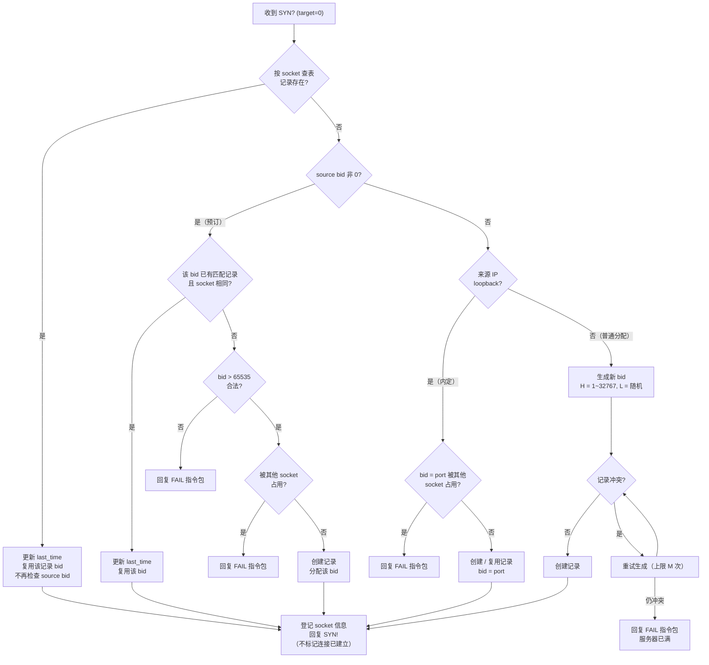

# Magpie Server 服务器设计

这里定义 Magpie Bridge 服务器。线程架构与数据流见 **architecture 文档**，此处补充各线程的详细规则、bid 管理与配置。

## 各模块（线程）设计

1. 服务器通过一个**接收线程**从绑定的 UDP 端口中读取数据包，然后直接放入等待处理队列；
2. **预处理线程**从前面的等待处理队列取出数据包，进行简单的校验之后，根据 target bid 决定是转交给"管理线程"处理，还是转交给"转发线程"处理；
3. 服务器有一个**管理线程**，专门负责 bid 的分配管理、超时记录回收（purge）、通行证管理（ACPT/DENY），以及几个系统命令的应答；
4. 服务器有 W 个**转发线程**，专门负责转发数据。

### 预处理线程校验

预处理线程需要校验的内容包括：

- 来源 IP 为广播或多播地址（IPv4 224.0.0.0/4 与 255.255.255.255、IPv6 ff00::/8 等）的数据包直接丢弃，不应答、不转发；正常数据包的来源地址不可能是广播/多播地址，此类来源多为伪造，若不丢弃，服务器向其应答/转发会使数据扩散到整个广播域或多播组，形成放大攻击；
- Magic Code；
- Type、header length、payload length，以及相互关系；
- 将实际数据包的长度与根据上面各字段计算得到的值进行比较；
- C=1 时 command 必须非 0（全 0 判定为错误包）；除此之外**不校验 command 的具体取值**，一律放行（具体值是否为系统指令、如何应答，由管理线程按场景处理，客户端自定义 command 亦不受限）；
- source bid = 0 且 target bid ≠ 0 属于服务端上行校验规则（客户端不得伪造服务器下发包），判定后直接丢弃；
- B=1 时 target bid 与 source bid 非 0 时不能相等（服务器转发包不能发往同一个客户端；同时为 0 是第一次握手包，例外），判定后直接丢弃。

### 管理线程

管理线程需要检查 command 及 source bid：

- 如果 command 是 "SYN?"，则为第一次握手（唯一允许 source bid 无内存记录的场景）：source bid 非 0 时一律走预订流程（无论来源是否 loopback，先检查该 bid 是否有匹配记录（记录存在且 socket 信息相同）则直接复用，否则检查其是否合法且未被占用，失败则回复 "FAIL" 指令包）；source bid 为 0 时，loopback 来源按内定规则分配 bid = port，其余来源分配新 bid；
- 否则 source bid 必须跟内存记录（socket 信息）匹配，然后根据 command 值进行相应的处理和应答：
	- "ACK!"（第三次握手，source bid > 0）：校验 socket 匹配，标记该记录为已确认（acknowledged，连接建立）；
	- "PING"（心跳，source bid > 0）：回复 "PONG"，同时更新其活跃时间；
	- "FIN?"（挥手，source bid > 0）：先回复 "FIN!" 指令包，然后删除记录，释放 bid；
	- ACPT/DENY（通行证管理，source bid > 0）：按通行证管理流程处理（解析载荷中的 bid 列表，全部有效则整体加入/移出通行证列表并回复 "DONE"，任一无效则整体不执行并回复 "FAIL"，详见 architecture 文档）；
	- 未知 command：直接丢弃。

### 转发线程

转发线程需要检查两个 bid，只有 socket 信息匹配才会转发；其中 source bid 还须已完成第三次握手（ACK!），且 (source bid, 当前 socket) 须在 target 记录的通行证列表中（收件人已通过 "ACPT" 接纳发送方），连接未确认时以 "FAIL"（载荷带 socket 信息，与 "SYN!" 相同）通知客户端，通行证不匹配时静默丢弃。

## Bridge ID 管理

bid 为一个 32 位无符号整数，实际应用中取高 16 位整数 H 与低 16 位整数 L（0 ~ 65535）合并而成：

| H 区间 | 含义 |
|--------|------|
| 0 | 内定保留区间（bid = port，供 loopback 内部进程使用） |
| 1 ~ 32767 | 当前启用的普通分配与预订区间 |
| 32768 ~ 65535 | 预留区间，当前不启用但合法，仅可能由客户端预订产生 |

socket 信息包括 ip 和 port 两个值，当其作为 key 查询时为 "{ip}:{port}" 的字符串。

设计要求：**bid 与 socket 信息一一对应**。

### 生成规则

bid (32位无符号整数) 由高 16 位无符号整数 H 和低 16 位无符号整数 L 构成：

1. 初始化内部私有变量 n（初始值为 1，最大值 32767）；
2. 每次生成时取 H = n（然后 n 自动 +1，超过最大值后回到 1）；
3. 每次生成时取 L = r（r 为随机整数，取值范围 0 ~ 65535）；
4. 最终获得 32 位无符号整数 bid = (H << 16) | L；
5. 检查内存中的分配表，如果 bid 冲突，回到步骤 2 重试；
6. 重试达到 M 次仍然冲突，表示服务器已满，暂时无法分配 bid，由管理线程回复 "FAIL" 指令包。

> 其中常量 M 默认 = 16（可通过配置文件 bid_allocation_retries 调整）
> 自动分配范围：服务器自动分配 bid 时，H 仅在 1 ~ 32767 范围内循环，即不会自动分配 H ≥ 32768 的 bid；该预留区间（H ≥ 32768）仅可能由客户端预订产生。

### 冲突判定

通过 bid 查询，如果记录不存在，或者记录中的 socket 信息相同，则无冲突；
反之，只要记录中的 socket 信息与当前不同，则判定为冲突（记录回收仅由管理线程在空闲时通过 purge 完成，其他线程不做超时覆盖判断）。

### 内存分配表

以 bid 为 key，或者 socket 信息为 key，均可查询分配记录。

记录字段包括：

- bid
- key  // "{ip}:{port}"
- socket 信息
- last_time  // 最后活跃时间
- acknowledged  // 是否已完成第三次握手（ACK!），置位后连接才算 established
- passes  // 通行证列表：本记录持有者已接纳的发送方 (bid, socket) 集合（允许向持有者发数据的白名单），由 ACPT/DENY 指令维护；随记录回收（purge）自动删除，无需额外清理

> key 为 socket 信息的字符串形式（"{ip}:{port}"），创建记录时生成一次即可；由于 ip 和 port 固定不变，后续查询时直接取用该字段，无需每次重新拼接。

服务器每次收到数据包并检查通过之后，就会更新 last_time 为当前时间；
注意，只有预处理线程和管理线程会更新 last_time，转发线程不需要这个动作，因为在预处理线程指派之前已经更新过了。

### 分配与回收

服务器收到握手请求（"SYN?" 指令）时的 bid 分配流程：



> 每次新建分配记录时，都需要同时建立两个索引（分别以 bid、socket 信息为 key）指向该记录，以方便后面查询。

**回收**：管理线程空闲时，调用 purge(now) 函数删除所有 `last_time < now - expires` 的记录（同时删除对应的 bid 和 socket 信息索引）以回收其所占用的 bid。

- 回收时效默认 24 小时（expires = 3600 * 24，秒），可通过配置文件 record_expires 调整；
- 即该 socket 超过回收时效（默认 24 小时）没有上行数据便可以判定过期并回收；
- purge(now) 调用间隔默认不小于 10 分钟（600 秒），可通过配置文件 record_recycle_interval 调整。

> 注："在线"判定窗口 T_active（默认 2 分钟，可通过配置文件 record_active_timeout 调整）与回收时效 expires（默认 24 小时，可通过配置文件 record_expires 调整）是两个不同的参数：T_active 用于转发线程判断记录是否活跃（在线），expires 用于管理线程回收超时记录。

### 内定与预订机制

由于一台机器能绑定的端口 port 取值范围刚好是 0 ~ 65535，与 bid 的低 16 位 L 取值范围一致，所以特设 H=0 作为保留 bid 给内部进程使用：

- **内定**：对于来源 IP 是环回地址（loopback: 127.0.0.0/8, ::1/128）且第一次握手请求中 source bid 为 0 的客户端，则直接用其端口 port 作为 bid 绑定（即 bid 的高 16 位 H=0），这个属于 Bridge ID 管理机制为内部进程保留的 bid 区间。内定 bid 与其他 bid 一样参与超时回收（24 小时无上行数据即释放）。若内定 bid 被其他 socket 占用（例如不同 loopback IP 使用相同端口），直接回复 "FAIL" 指令包，由客户端进程自行协商后续。
- **预订**：客户端（无论 loopback 还是外部来源）在发送 "SYN?" 请求分配 bid 的时候，只要预设了 source bid（非 0），即走预订流程，不再走内定流程：先检查该 source bid 是否已有匹配记录（记录存在且 socket 信息相同，例如 loopback 客户端重新握手时携带之前的内定 bid），有则直接复用；否则检查其是否合法（必须大于 65535，即不能预订保留给 loopback 的内定区间）且未被其他 socket 占用：合法且空闲则分配给当前 socket；如果非法、或被其他 socket 占用，则回复 "FAIL" 指令包。

注意：客户端不能预订 H=0 的内定区间（0 ~ 65535），即所有预订成功的 bid 必定大于 65535；预订 bid 不设上限（H 合法范围 0 ~ 65535），其中 H ≥ 32768（bid ≥ 2147483648）属于预留区间，服务器校验时不拒绝，但实际应用中无特殊原因不要申请这类预订 bid；loopback 客户端若想放弃"内定权利"（不想要 bid = port），在 "SYN?" 中预设 source bid 走预订流程即可。

## 流量控制

为了避免流量风暴，转发线程需要增加一个限流措施（设定一个在规定时间内最多处理多少任务的上限值）。由于系统将转发任务拆分给 W=8 条线程处理，所以单条线程的任务达到上限不会影响其他线程，将风暴控制在一个很小的影响范围之内。

限流采用**滑动窗口**方式：每条转发线程在 `forward_window` 秒内最多处理 `forward_limit_per_window` 个任务，达到上限后本轮窗口内不再取新任务，等待下一个窗口再继续；超过队列容量（forwarder_queue_size）的新包直接丢弃并记录日志（由客户端可靠传输机制重试）。

当前默认配置下单线程上限为 `4096 / 0.1s = 40960 包/秒`，8 条线程合计约 `327,680 包/秒`；单线程转发队列容量 `65536`（最坏约 64 MiB/线程，按满载荷 1KiB 计），足以缓冲约 1.6 秒的突发流量。相关参数均可通过配置文件调整：

- forwarders（线程数，默认 8）
- forwarder_queue_size（单线程转发队列容量，默认 65536）
- forward_limit_per_window（每窗口处理上限，默认 4096）
- forward_window（窗口时长，默认 0.1 秒）

## 工程目录

> 其中 Python 版服务器与 Python 版 SDK 共用一个库 'magpie-bridge'。

### Java 版服务器

工程根目录：
    magpie/server-java/

### Python 版服务器

代码目录：
    magpie/sdk-py/magpie_bridge/bridge/

工程配置参数：
    'console_scripts': [
        'magpie-bridge=magpie_bridge.bridge.run:main'
    ]

协议定义相关的代码放在 protocol/ 目录下，工具类代码放在 magpie/ 下，服务器代码放在 bridge/ 下。

> pip install magpie-bridge

执行此命令安装之后，即可通过命令 `magpie-bridge [参数]` 启动服务器。

## 启动参数

命令行均为命名参数，全部可选：

    magpie-bridge [--config=<FILE>] [--log-dir=/tmp]    (Python 版命令)
    java -jar magpie-bridge.jar [--config=<FILE>] [--log-dir=/tmp]   (Java 版入口)

- --config     配置文件路径（缺省尝试默认路径，见下；两版均支持）
- --log-dir    日志目录（默认为空，不写文件；两版均支持）

未知参数会打印用法提示并退出。

## 配置文件

默认路径： /etc/magpie/config.ini

> 未通过 --config 指定时尝试读取默认路径；文件不存在、段或键缺失时，一律回退到代码默认值。

默认配置：

```
[magpie-bridge]
host = 0.0.0.0
port = 9527

# UDP receive buffer size of the kernel socket (bytes, default:
# 4194304 = 4 MB; the kernel may clamp it to the system rmem_max)
socket_buffer_length = 4194304

# threads: forwarder thread count W (default: 8)
forwarders = 8
# forwarder rate limit: max packets processed per window (default: 4096)
forward_limit_per_window = 4096
# forwarder rate limit window (seconds, default: 0.1)
forward_window = 0.1

# record lifecycle: a bid record is recycled when it has no uplink
# traffic for longer than this (seconds, default: 86400.0 = 24 hours)
record_expires = 86400.0
# minimum interval between two purge(now) runs (seconds, default:
# 600.0 = 10 minutes)
record_recycle_interval = 600.0
# online judging window: the forwarder drops the target when its
# record has been inactive for longer than this (seconds, default:
# 120.0 = 2 minutes)
record_active_timeout = 120.0
# bid allocation retries: treat the server as full after M conflicts
# (default: 16)
bid_allocation_retries = 16

# waiting queue capacity: receiver -> preprocessor (default: 4096)
waiting_queue_size = 4096
# manager queue capacity: preprocessor -> manager (default: 1024)
manager_queue_size = 1024
# forwarder queue capacity: preprocessor -> forwarder, per forward
# thread (default: 65536; when full the packet is dropped and logged,
# the client retries it via the reliable transport)
forwarder_queue_size = 65536
```

**规则说明**：

1. 所有时间值均为**浮点数的秒**（如 0.1 秒），代码内部自行转换为毫秒等内部单位；
2. 容量类参数（waiting_queue_size、manager_queue_size、forwarder_queue_size、socket_buffer_length）均为整数：前三者是包数，后者是字节数；
3. 所有键缺失、段缺失或文件缺失时均回退到代码默认值（host 默认 0.0.0.0、port 默认 9527、forwarders 默认 8，与其余键行为一致）；
4. 命令行 --config 指定的路径优先于默认路径；配置文件不存在时不报错，直接使用全部默认值。
