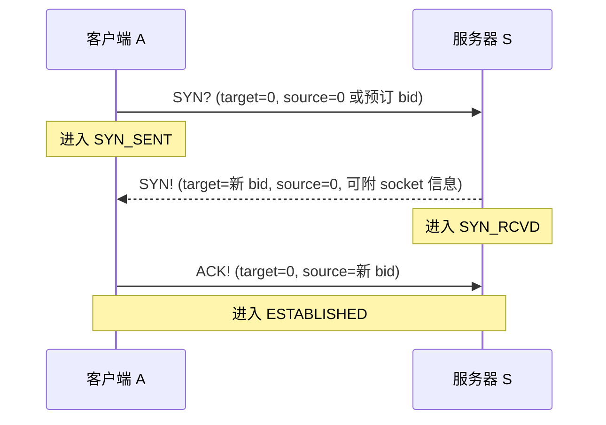
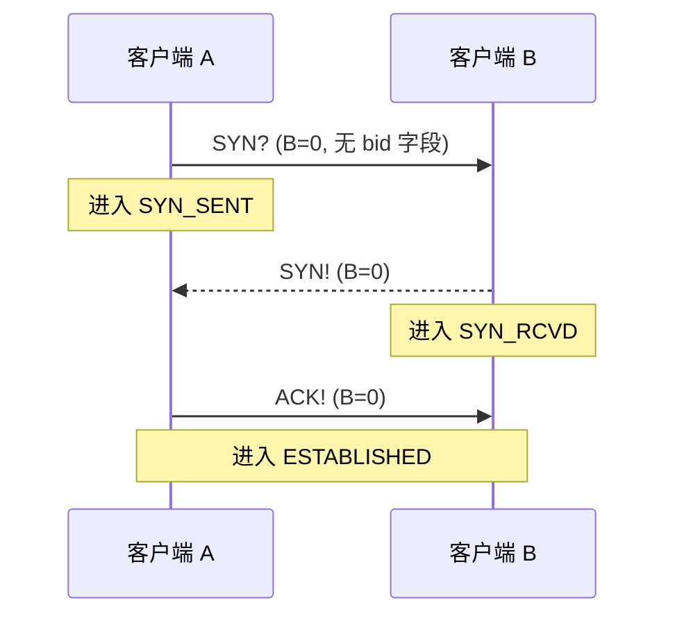
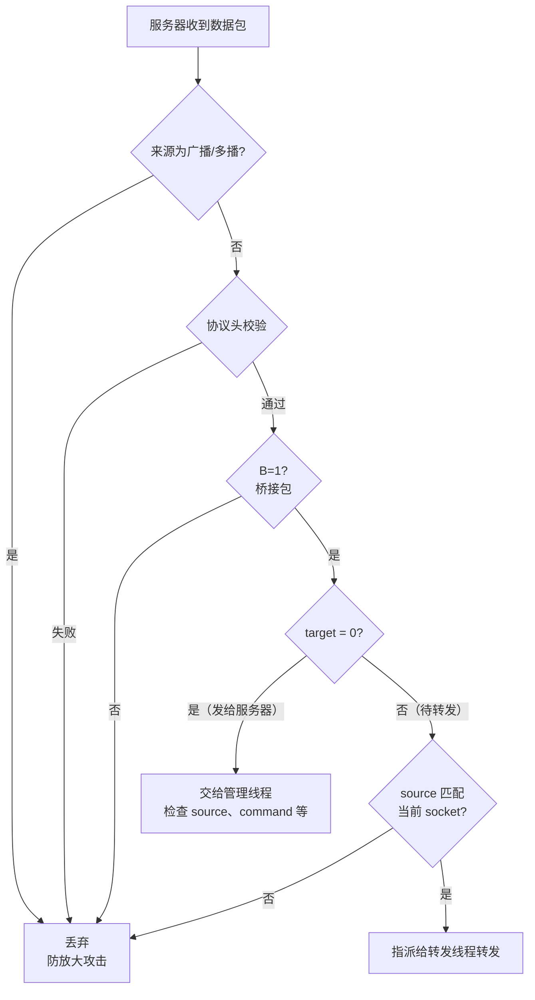
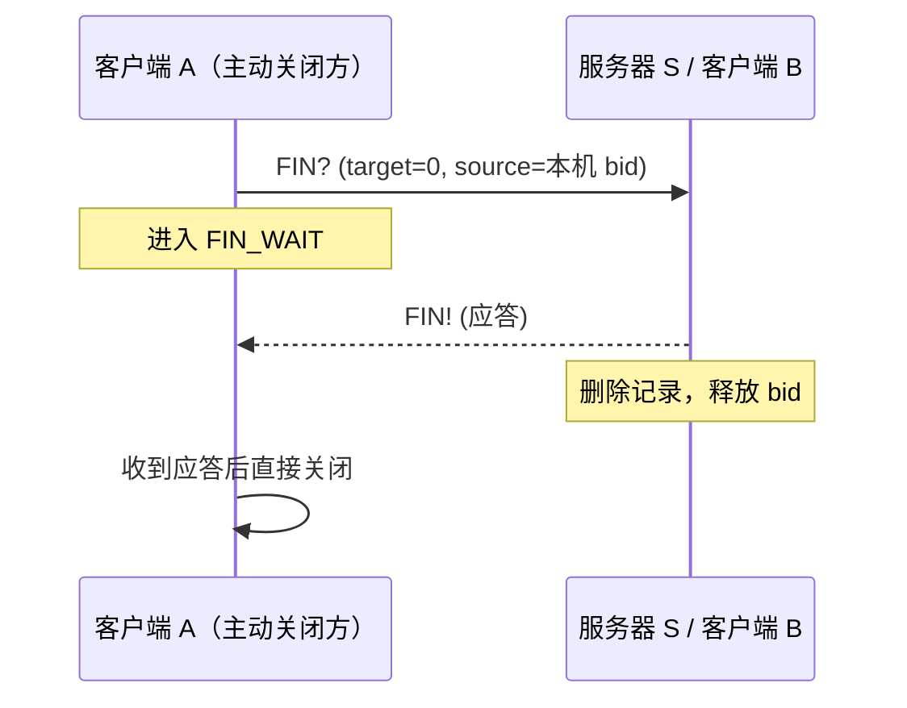
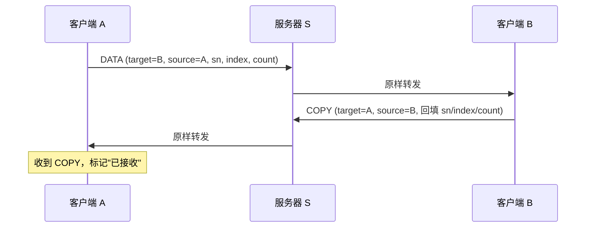
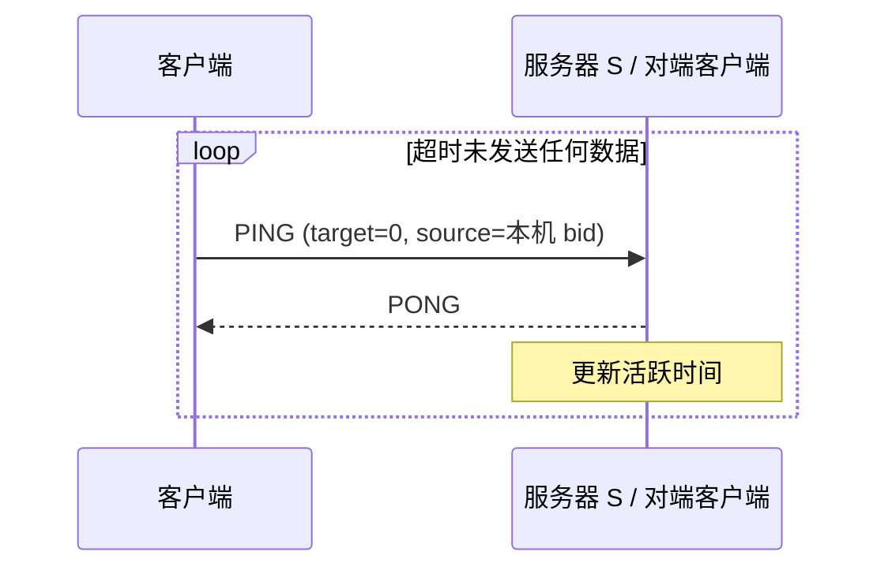

# Magpie Bridge Workflow（工作流设计）

> 主要角色：**客户端（A/B）** 与 **转发服务器（S）**。可直连则直连，否则经服务器转发；转发服务器彼此独立，客户端按连通速度自行选择。

## 1. 握手机制（搭桥，建立连接）

客户端向服务器申请 bid（Bridge ID，门牌号）；直连双方无需 bid，但仍需握手建立“连接”。

|        | Flags               | Command | SN |
|--------|---------------------|---------|-----|
| 第 1 次 | A=0, C=1, D=0, E=0  | "SYN?"  | -   |
| 第 2 次 | A=1, C=1, D=0, E=0  | "SYN!"  | -   |
| 第 3 次 | A=1, C=1, D=0, E=0  | "ACK!"  | -   |
| 失败    | A=1, C=1, D=0, E=0  | "FAIL"  | -   |

> 失败行：服务器 bid 分配失败（预订被占用/非法、内定冲突、服务器已满）时以 "FAIL" 应答，由客户端自行决定重新申请或放弃。

> "FAIL" 的载荷区分两种失败：bid 分配失败时载荷为空，客户端重新申请或放弃；连接未确认（漏发第三次握手 "ACK!"）时载荷为 socket 信息 `{"UDP":"ip:port"}`（与 "SYN!" 相同，该 FAIL 除 command 外与 "SYN!" 字段一致：target=bid、source=0、无 sn/分包参数），客户端可直接补发 "ACK!"（幂等），无需重新握手。

> 系统指令（D=0）不携带 sn，应答靠 socket 配对：从哪个 socket 收到请求，就回哪个 socket；source bid 不决定应答发给谁，仅用于身份校验（验证 bid 与 socket 的绑定关系）。发送方无需维护等待应答的队列。
>
> 数据包（D=1）不同：直连（B=0）收件人即对方 socket；桥接（B=1）收件人由 target bid 指定；"COPY" 应答均靠 sn 配对。

### 1.1. 客户端 → 服务器（C-S 握手）

1. **第一次握手**：客户端发送 "SYN?"（target=0，source 一般为 0，可用预订机制预设期望 bid），进入 SYN_SENT；
2. **第二次握手**：服务器分配 bid 成功后回复 "SYN!"（target=新 bid，source=0，可附 socket 信息），进入 SYN_RCVD；分配失败（预订被占用/非法、内定冲突、服务器已满）回复 "FAIL"；
3. **第三次握手**：客户端发送 "ACK!"（target=0，source=刚收到的 bid），服务器验证无误后将 bid 与 socket 一起指派给转发线程，双方进入 ESTABLISHED。

> 服务器回复 "SYN!" 时可附带客户端 socket 信息，例如载荷内容 `{"UDP":"12.34.56.78:12345"}`。

### 1.2. 客户端 → 客户端（C-C 直连握手）

B=0，即协议头不含 bid 字段，表示直接发送，无需服务器 relay。

> A 收到 "SYN!" 并发出 "ACK!" 后，即可在本地标注连接已建立（建立一条“有向管道”）；B 收到 "ACK!" 时同样标注。双方各管理一条单向“连接”。

### 1.3. 关于 bid

- 服务器即“桥”（bridge），bid 是客户端首次连接时分配的整数（门牌号）；
- 客户端把 bid 广播出去，其他用户发送数据时在 target bid 位置填上号码，服务器从注册表找到对应 socket 转发；
- **target=0**：服务器认为包是发给自己的（一般用于握手/挥手/心跳）；
- **source=0**：只可能是服务器下发的包；客户端经服务器转发时必须填自己的 bid，否则无法生成自动应答；
- 服务器收到 target/source 全不为 0 的包才认为是待转发包，两个 bid 都必须与记录匹配，匹配则原样转发（不做任何改动）。

## 2. 挥手机制（关闭连接）

|        | Flags               | Command | SN |
|--------|---------------------|---------|-----|
| 第 1 次 | A=0, C=1, D=0, E=0  | "FIN?"  | -   |
| 第 2 次 | A=1, C=1, D=0, E=0  | "FIN!"  | -   |

- 单条有向管道的挥手只有 2 步（FIN? / FIN!），直接关闭；
- C-C 场景存在两条“有向管道”，每条由发起方主动 FIN 后直接关闭，另一侧被动关闭后接着主动发起反方向管道的关闭流程，总体上与 TCP 4 次挥手相当。

## 3. 发送机制

发送途径有两种：**通过服务器转发** 与 **直接发送**。

### 3.1. 通过服务器转发

|   | Flags               | Command | SN   | Index, Count |
|---|---------------------|---------|-------|--------------|
| 1 | A=0, B=1, C=0, D=1  | -       | 自增值 | 实际分包信息   |
| 1 | A=0, B=1, C=1, D=1  | "DATA"  | 自增值 | 实际分包信息   |

1. 双方先在服务器注册 bid；
2. 发送方 A 将双方 bid 填入协议头相应位置，发给服务器 S；
3. S 检查 target bid 是否存在且**活跃**（规定时间 T 内有上行数据包；T 为“在线”判定窗口，一般小于 2 分钟，与超时回收时效 expires 无关），同时检查 source bid 与当前 socket 是否匹配，通过后原样转发（发送方的活跃时间已在预处理阶段更新）；连接未确认（漏发 "ACK!"，尚未 ESTABLISHED）时不予转发：转发线程检查 source bid 时发现连接未建立，即以 "FAIL"（载荷带与 "SYN!" 相同的 socket 信息）通知客户端并丢弃该包；
4. 服务器转发时不回复应答包，发送方通过接收方自动回复的 "COPY" 确认收到。

### 3.2. 直接发送

|   | Flags               | Command | SN   | Index, Count |
|---|---------------------|---------|-------|--------------|
| 2 | A=0, B=0, C=0, D=1  | -       | 自增值 | 实际分包信息   |
| 2 | A=0, B=0, C=1, D=1  | "DATA"  | 自增值 | 实际分包信息   |

双方建立“连接”后直接打包发送给对方（B=0，无 bid 字段）。

## 4. 应答机制

客户端收到普通数据包（A=0, D=1，command 为 "DATA" 或无 command）时，均需回复数据应答包 "COPY"（A=1, D=1，回填源 sn 及 index/count）。

系统指令（D=0）不回复 "COPY"，而是回复各自的专用应答（SYN!/PONG/FIN!，失败场景回复 "FAIL"）。

|   | Flags               | Command | SN   | Index, Count |
|---|---------------------|---------|-------|--------------|
| 1 | A=1, B=1, C=1, D=1  | "COPY"  | 源值  | 源分包信息     |
| 2 | A=1, B=0, C=1, D=1  | "COPY"  | 源值  | 源分包信息     |

**参数设置**：

1. 将 type 最高位 A 置 1：`type = type | 0x80`，表示应答；
2. 若 B=1（经服务器转发），将 target 和 source 对调，发回同一个服务器中转；
3. 令 C=1：`type = type | 0x20`，command 字段设为 "COPY"；
4. 若 D=1，sn 和可能存在的 index, count 均保持不变；
5. 标志位 B/D/E 不变；
6. 载荷为空，也可携带自定义信息。

## 5. 心跳机制（保活）

客户端定期检查自身发送时间，超过预设时间无任何数据包发送（含应答包），则主动发送“心跳”包维持连接状态。

|   | Flags               | Command | SN |
|---|---------------------|---------|-----|
| 1 | A=0, C=1, D=0, E=0  | "PING"  | -   |
| 2 | A=1, C=1, D=0, E=0  | "PONG"  | -   |

- 心跳包发给服务器时 B=1（target=0, source=本机 bid）；直连时 B=0；
- 服务器无需主动发起心跳，C-S 结构的连接状态由客户端负责维护；
- 直连场景为两条“有向管道”，各自由发起方负责主动维护。
